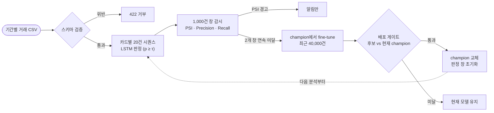

# 카드 거래 이상탐지 AIOps 조별 실습

W13 모델 서빙 및 AIOps 과정의 조별 과제입니다. 과제 마감은 2026-10-08입니다.

## 1. 목적

카드 사기 탐지 모델은 서버가 정상 응답을 계속 돌려주는 동안에도 조용히 나빠질 수 있습니다. 새 사기 수법이 나오면 모델은 그 거래에 경보를 울리지 않고, 서버는 에러 없이 틀린 판정을 내놓기 때문입니다.

그래서 이 프로젝트는 판정에서 끝나지 않고, 운영 중 성능 하락을 감지해 재학습하고, 검증을 통과한 모델만 운영에 올리는 흐름까지 만듭니다.

- **판정**: 기간별 카드 거래 CSV를 올리면 카드별 최근 20건의 흐름을 LSTM이 읽어 마지막 거래의 사기 확률을 내고, τ 이상이면 사기로 표시합니다.
- **감시**: 판정 거래를 1,000건 창으로 묶어 PSI(분포 변화)와 Precision·Recall(성능)을 계산합니다. PSI는 알림만 보냅니다.
- **재학습과 교체**: 성능이 2개 창 연속으로 평소 범위(평균 − 2σ) 아래로 떨어지면 운영 모델에서 이어서 학습한 후보를 만들고, 배포 게이트를 통과할 때만 운영 모델(MLflow `champion`)을 교체합니다. 서버는 재시작 없이 다음 분석부터 새 모델을 씁니다.

데이터는 AI Hub 금융거래 합성데이터 1,952,871건(카드 2,636장, 이상거래 3.69%)입니다([데이터 분석](../docs/데이터분석.md)).

## 2. 구조



| 영역 | 파일 | 역할 |
|---|---|---|
| 전처리 | `data/features.py`, `data/csv_input.py` | 학습·서빙 공용 피처 17개와 20건 시퀀스, CSV 입구 검사 |
| 모델 | `serving_app/lstm_model.py` | LSTM 32 → 32 → 16, sigmoid 출력 |
| 판정 서버 | `serving_app/main.py`, `routers/`, `batch_service.py` | CSV 업로드·배치 판정·결과 조회 FastAPI |
| 모델 로딩 | `serving_app/model_loader.py`, `registry.py` | champion이 가리키는 버전의 모델·스케일러·τ를 함께 로딩, 바뀌면 재로딩 |
| 감시 | `serving_app/monitoring/drift_monitor.py`, `metrics.py` | 1,000건 창, PSI 알림, 연속 미달과 재학습 요청, 서버 재시작 시 중단된 재학습 정리 |
| 재학습 | `serving_app/retrain.py` | champion에서 fine-tune → τ 선택 → 게이트 심사 → 교체 |
| 배포 게이트 | `serving_app/monitoring/deployment_gate.py`, `train_and_register.py` | 후보와 현재 champion을 같은 홀드아웃에서 비교, 조건부 교체 |
| 대시보드 | `../frontend/index.html` | 판정 결과, PSI, 판정 창, 재학습·게이트 결과 표시 |
| 시연 | `scripts/make_scenarios.py`, `run_demo.py`, `demo_docker.sh` | 6개월 시나리오 CSV 생성과 시연 실행 |
| 테스트 | `tests/` | API, 게이트, PSI, 판정 창 감시, 재시작 복구, 재학습 통합, Registry 흐름 45개 |

자세한 API는 [서버 가이드](../docs/FastAPI-CSV서버.md)와 [API 명세](../docs/API명세.md), 화면은 [대시보드 README](../frontend/README.md)에 있습니다.

## 3. 실행과 시연

### 시연 한 번에 실행 (Docker)

```bash
bash backend/scripts/demo_docker.sh
```

`model-runtime` 컨테이너를 새 볼륨으로 띄우고, 컨테이너 안의 빈 Registry에 v1을 등록한 뒤, 2024년 7~12월 시나리오 CSV를 순서대로 분석합니다. 마지막에 월별 요약 표와 대시보드 주소(`http://127.0.0.1:8099/`)를 출력합니다. 처음 실행은 이미지 빌드 때문에 4~5분, 시연 부분은 약 37초 걸립니다. 컨테이너는 볼륨 안의 Registry만 쓰므로 호스트의 `backend/mlflow.db`·`backend/mlruns`는 바뀌지 않습니다.

필요한 것: Docker, `backend/serving_app/models/`의 v1 파일, `data/scenarios/2024-07.csv`~`2024-12.csv`. 시나리오 CSV가 없으면 스크립트가 생성 명령(`.venv/bin/python backend/scripts/make_scenarios.py`, 원본 전처리 데이터 필요)을 안내하고 멈춥니다. 자세한 단계와 로컬 실행 방법은 [서버 가이드](../docs/FastAPI-CSV서버.md#6개월-시연-실행)에 있습니다.

### 서버만 실행

```bash
docker compose -f backend/serving_app/docker-compose.yml up -d --build
```

기본 `api` 이미지는 모델 런타임이 없어 분석이 HTTP 503이며, 실제 판정은 [서버 가이드](../docs/FastAPI-CSV서버.md#모델-연결)의 `model-runtime` 절차를 따릅니다. 기본 포트는 8099이고 Swagger는 `/docs`입니다.

### 데이터 준비부터 학습·등록·테스트까지

저장소 최상위 폴더에서 실행합니다. 원본 CSV는 별도로 `data/raw/train/`, `data/raw/valid/`에 준비합니다.

```bash
python3 -m venv .venv
source .venv/bin/activate
pip install -r backend/requirements.txt httpx2==2.13.0

python backend/scripts/prepare_data.py
python backend/scripts/train_baseline_v1.py
python backend/scripts/measure_v1.py
python backend/scripts/compare_beta.py
python -m backend.serving_app.train_and_register
python backend/scripts/make_scenarios.py
python -m unittest discover -s backend/tests -t . -v
```

`train_and_register`는 v1을 버전 1로 등록하고 `champion`으로 지정하며, 운영 모델이 이미 있으면 거부합니다. MLflow 화면은 `mlflow ui --backend-store-uri sqlite:///mlflow.db --host 127.0.0.1 --port 5001`로 엽니다.

원본 데이터, 학습 모델, 스케일러, MLflow DB·아티팩트, 시나리오 CSV(`data/scenarios/`)는 Git에서 제외하므로, 복제한 환경에서는 위 명령으로 다시 만듭니다.

## 4. 결과

### v1 기준 성능 (2024년 상반기, 학습에 쓰지 않은 기간)

| τ | F2 | Recall | Precision | PR-AUC | 경보 비율 |
|---|---|---|---|---|---|
| 0.28 | 0.9089 | 0.9519 | 0.7700 | 0.9419 (기준선 0.0360) | 4.45% |

출처: `serving_app/models/thresholds.json`, [설계 지표](../docs/설계지표.md) 8절.

### 6개월 운영 시연

출처: [시연 실행 로그](../docs/results/시연-실행-로그.txt). ②·③은 주입한 시뮬레이션이며, 정답이 즉시 확정된다고 가정합니다.

| 월 | 시나리오 | 판정 모델 | Recall | F2 | 감시와 재학습 |
|---|---|---|---|---|---|
| 7월 | ① 정상(실제) | v1 | 0.910 | 0.883 | Recall 2개 창 연속 미달 → 후보 v2 게이트 미달(Recall 0.923 < 0.95), v1 유지 |
| 8월 | ① 정상(실제) | v1 | 0.952 | 0.910 | 알림 없음 |
| 9월 | ② 명절(금액 1.5배) | v1 | 0.928 | 0.881 | PSI 경고 창 8개, 명절로 인한 재학습 없음. 명절 직전 실제 데이터의 하락으로 후보 v3 심사 → 미달(Recall, F2 회귀) |
| 10월 | ③ 신종 사기 | v1 | 0.787 | 0.785 | Recall 미달 창 29개 → 후보 v4 통과(홀드아웃 Recall 0.953, F2 0.903, 경보 5.45%), champion 교체 |
| 11월 | ③ 신종 사기 | v4 | 0.964 | 0.923 | 서버 재시작 없이 v4가 판정 |
| 12월 | ③ 신종 사기 | v4 | 0.958 | 0.915 | 알림 없음 |

같은 시연을 `model-runtime` 컨테이너에서 HTTP로 돌린 결과도 월별로 같았습니다([검증 결과](../docs/results/검증결과.md#docker-컨테이너-시연)).

### 검증

- 자동 테스트 45개 통과(CSV/API 15, 배포 게이트 9, 판정 창 감시·시간 분할 8, 분석 API 감시 연결·재시작 복구 7, PSI 3, 재학습 통합 2, Registry 흐름 1).
- 원본 1,952,871건을 서버 경로로 변환한 입력이 학습 입력과 시퀀스 1,281,085개에서 최대 차이 0(파일마다 따로 변환해 전체 시퀀스 1,904,014개보다 적음).
- MLflow에서 다시 불러온 champion이 로컬 v1과 검증 시퀀스 20,000건에서 점수 차이 0.

전체 목록과 시연 중 찾아 고친 문제는 [검증 결과](../docs/results/검증결과.md)에 있습니다.

## 5. 설계 결정

| 결정 | 이유 | 근거 문서 |
|---|---|---|
| 정확도 대신 F2(β = 2) | 사기율 3.7%라 전부 정상으로 찍어도 정확도 96.3%입니다. 사기 평균 금액(1,040,459원)이 정상(24,893원)의 약 42배라 Recall에 무게를 둡니다. β 1 → 2는 정상 고객 2.3명 확인으로 사기 1건을 더 잡고, 그 이상은 대가가 6.5명 이상으로 커집니다 | [설계 지표](../docs/설계지표.md) 1·4절 |
| τ는 F2 최대 | 모델은 확률만 내므로 합격선이 필요합니다. 모델마다 다르므로 모델과 함께 저장하고 함께 교체합니다 | 설계 지표 3절 |
| 1,000건 창, 평균 − 2σ, 2개 창 연속 | 21건 창에는 사기가 평균 1건도 안 들어갑니다. 정상 상반기에서 −1σ는 잘못된 재학습 15회, −2σ와 연속 조건은 0회였습니다 | 설계 지표 5-3·5-4절 |
| PSI는 알림만 | 명절처럼 분포만 바뀌고 성능은 그대로인 경우 재학습하지 않기 위해서입니다 | 설계 지표 5-4절 |
| 배포 게이트 | 후보와 현재 champion을 같은 최근 홀드아웃에서 비교합니다. F2 회귀 없음, Recall ≥ 0.95, 경보 비율 ≤ 6%(처리량 가정), 표본 1,000건·사기 20건 이상 | 설계 지표 4절 |
| v1은 게이트 없이 등록 | 비교할 운영 모델이 없는 기준 모델이기 때문입니다. 이후 모델은 모두 게이트를 거칩니다 | 설계 지표 4-2절 |
| 시간순 분할, 고정 스케일러 | 제공된 분할은 같은 기간을 무작위로 나눠 미래 정보가 섞입니다. 스케일러를 다시 맞추면 기존 가중치와 어긋납니다 | [데이터 분석](../docs/데이터분석.md) 2절, 설계 지표 6절 |
| 재학습 데이터 40,000건, 60 / 20 / 20 | 한 달 분량입니다. 더 넓히면 앞부분이 드리프트 이전 데이터로 채워집니다. τ 선택과 게이트 시험지를 분리해 점수가 낙관적으로 나오지 않게 합니다. 같은 거래는 두 구간에 들어가지 않습니다 | 설계 지표 6절 |

## 6. 한계와 향후 과제

| 항목 | 내용 |
|---|---|
| 시뮬레이션 | 데이터에 자연스러운 신종 사기 드리프트가 없어 명절과 신종 사기는 주입했습니다 |
| 정답 지연 | 시연은 정답이 즉시 들어온다고 가정합니다. 실제로는 늦게 확정됩니다 |
| 절대 Recall 하한 | 7월 후보는 운영 모델보다 나았지만(F2 0.866 대 0.839) Recall 0.95 미만이라 떨어졌습니다. 완화 여부는 팀 결정 사항입니다 |
| v4의 얇은 여유 | Recall 0.953(하한 0.95), 경보 5.45%(상한 6%) |
| 기준 승계 | 후보는 v1의 트리거 기준과 거래 피처 PSI 기준을 그대로 씁니다 |
| 경보 상한 6% | 실제 탐지팀 인력으로 확인한 값이 아닌 처리량 가정입니다 |
| 롤백 | 교체 직후 다시 나빠질 때 이전 버전으로 되돌리는 기능은 미구현입니다 |

팀 결정이 필요한 사항과 선택지는 [현황과 남은 작업](../docs/현황과-남은작업.md) 7절에 정리했습니다.

## 문서

- [발표자 가이드](../docs/발표자-가이드.md): 발표 흐름, 시연 대본, 예상 질문
- [설계 지표](../docs/설계지표.md): 지표·기준값·시연 시나리오의 근거
- [데이터 분석](../docs/데이터분석.md)
- [4단계 MLflow와 배포 게이트](../docs/4단계-MLflow와-배포게이트.md)
- [서버 가이드](../docs/FastAPI-CSV서버.md) · [API 명세](../docs/API명세.md) · [OpenAPI JSON](../docs/openapi.json)
- [검증 결과](../docs/results/검증결과.md) · [시연 실행 로그](../docs/results/시연-실행-로그.txt)
- [현황과 남은 작업](../docs/현황과-남은작업.md)
- [발표 노트](../docs/발표노트.md)
