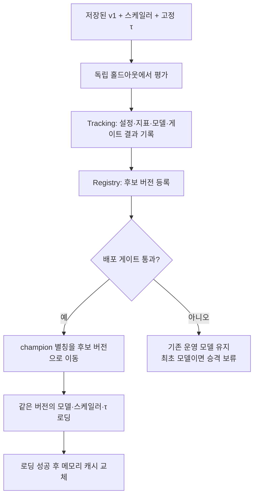

# 4단계: MLflow 기록, 후보 등록, 배포 게이트

## 이번 단계의 결과

기존 `fraud_v1.keras`를 재학습하지 않고 MLflow에 기록하고 `CardFraudLSTM`의 후보 버전 1로 등록했습니다. 모델·스케일러·τ와 운영 기준이 같은 실행에 묶였습니다.

2024년 7월 독립 평가에서 Recall 0.9104가 기준 0.95에 미달했기 때문에 운영 승격은 보류했습니다. 후보 버전은 존재하지만 `champion` 별칭은 없습니다. 등록과 운영 승격은 별개입니다.

## 기록부터 운영 선택까지



Tracking의 실행(run)은 설정과 지표를 기록하는 단위입니다. Registry 버전은 해당 모델을 번호로 찾아 쓸 수 있게 만든 보관 단위입니다. `champion`은 그중 현재 운영에 사용할 버전을 가리키는 별칭입니다.

수업의 Production 단계와 같은 선택 역할을 `champion` 별칭으로 구현했습니다. 설치된 MLflow 3.16에서 지원하는 별칭 API를 사용했습니다. [MLflow 공식 Registry 문서](https://mlflow.org/docs/latest/ml/model-registry/workflow/)

## 같은 버전에서 불러와야 하는 세 가지

| 구성품 | MLflow 저장 위치 | 필요한 이유 |
|---|---|---|
| LSTM 모델 | logged model | 거래 시퀀스에서 점수를 계산합니다 |
| 고정 스케일러 | 실행의 `bundle/scaler.pkl` | 학습할 때와 같은 숫자로 입력을 변환합니다 |
| τ·피처 순서·운영 기준 | 실행의 `bundle/settings.json` | 모델 점수를 판정으로 바꾸고 입력 순서를 확인합니다 |

로더는 운영 별칭을 조회해 버전 번호를 먼저 고정합니다. 이어서 그 버전의 모델과 같은 run의 bundle을 불러옵니다. 로딩 중 별칭이 바뀌더라도 모델과 τ가 서로 다른 버전에서 오지 않도록 했습니다.

`reload_model()`은 새 구성품을 전부 불러온 뒤 캐시를 교체합니다. 새 구성품을 읽다가 실패하면 기존 캐시가 유지됩니다. 별칭 변경만으로 이미 메모리에 올라온 모델이 자동 교체되는 것은 아닙니다.

## 게이트 조건

| 검사 | 통과 조건 |
|---|---|
| 평가 표본 | 최소 1,000건, 실제 이상거래 최소 20건, 정상 거래 존재 |
| Recall | 0.95 이상 |
| 경보 비율 | 6% 이하 — 업무 처리량에 대한 가정 |
| F2 | 현재 운영 모델 이상 — 최초 모델은 비교 생략 |
| 입력 점수 | 0~1의 유한한 값, 정답과 같은 길이 |

후보와 현재 운영 모델은 같은 정답·입력에서 각각 자신의 τ로 평가합니다. τ는 게이트 데이터에서 다시 고르지 않습니다.

이전 P_min 0.5696은 게이트에 사용하지 않습니다. 실제 Recall이 가정한 0.95보다 높으면 P_min을 통과하고도 경보가 6%를 넘을 수 있으므로, 경보 비율을 직접 검사합니다.

## 독립 평가 결과

| 항목 | 값 |
|---|---|
| 평가 구간 | 2024-07-01~2024-07-31 |
| 평가 거래 | 40,324건 |
| 실제 이상거래 | 1,496건 |
| τ | 0.28 |
| Recall | 0.9104278075 |
| Precision | 0.7863741339 |
| F2 | 0.8825816485 |
| PR-AUC (average precision) | 0.9310278377 |
| 경보 비율 | 0.0429520881 |
| 실패 조건 | Recall |
| Registry 버전 | 1 |
| 운영 별칭 | 없음 |

상반기는 τ를 고른 구간이므로 최초 게이트에서 재사용하지 않았습니다. 거래 기간을 성능 확인 전에 고정하고 7월을 게이트에, 8~12월을 이후 운영 시연에 배정했습니다. 이 날짜들은 데이터의 시점이며 과제 일정은 내일(2026-10-08) 마감입니다.

Recall 저하의 원인은 아직 확정하지 않았습니다. 입력 변환을 점검한 표본에서는 오류가 발견되지 않았지만, 그 결과만으로 개념 드리프트를 확정할 수는 없습니다.

## 검증한 것

1. 실제 v1을 MLflow에서 다시 불러온 뒤 40,324건을 비교했습니다. 점수 최대 차이는 0이며 판정과 스케일러도 일치했습니다.
2. 원본 전체 이력과 운영 파일에서 만든 입력을 카드 19장·396건 표본으로 대조했습니다. 입력·정답·순서가 일치했습니다.
3. 게이트의 Recall·경보 경계값, F2 회귀, 다른 τ 사용, 표본 부족, 잘못된 점수를 검증했습니다.
4. 합성 시험용 모델과 임시 DB로 최초 통과, 실패 후보 등록 및 운영 교체 차단, 성공 후보 교체, 캐시 재로딩과 실패 시 캐시 유지를 검증했습니다. 합성 시험 모델은 실제 재학습한 v2가 아닙니다.
5. 같은 점수가 여러 번 나올 때 average precision을 점수 그룹 단위로 계산하도록 보완했습니다. 일정한 점수의 average precision이 사기율과 같고, 정답 정렬 순서에 영향을 받지 않는지 확인했습니다.

## 재현 명령

프로젝트 최상위 폴더에서, 데이터와 v1을 준비한 뒤 실행합니다.

```bash
python -m backend.serving_app.train_and_register
python backend/scripts/verify_stage4.py
python -m unittest discover -s backend/tests -t . -v
```

현재 v1은 게이트에 미달하므로 첫 명령은 후보를 등록한 뒤 종료 코드 2를 반환합니다. 평가와 검증 결과는 `backend/logs/stage4-registration.json`, `backend/logs/stage4-verification.json`에 남습니다. MLflow run에는 `gate.json`, `evaluation.json`, `registration.json`이 저장됩니다.

코드는 프로젝트의 절대 경로로 SQLite DB와 아티팩트 위치를 정합니다. 테스트에서는 `FRAUD_MLFLOW_DIR`로 임시 경로를 지정해 실제 후보 기록에 영향을 주지 않습니다.

## 다음 작업

현재 구현은 후보를 기록하고 기준에 따라 승격하는 장치까지입니다. 카드 거래 FastAPI 라우터, 운영 감시, fine-tuning과 자동 재로딩 호출은 다음 단계에서 연결합니다.

실제 v1의 운영 승격에는 Recall 개선이 필요합니다. 모델이나 τ 선택 방법을 개선할 때 조정 데이터와 최종 게이트 데이터를 다시 분리해야 합니다. 이미 결과를 확인한 7월을 조정에 쓰고 같은 7월의 결과를 새 독립 평가라고 부르지 않습니다.
