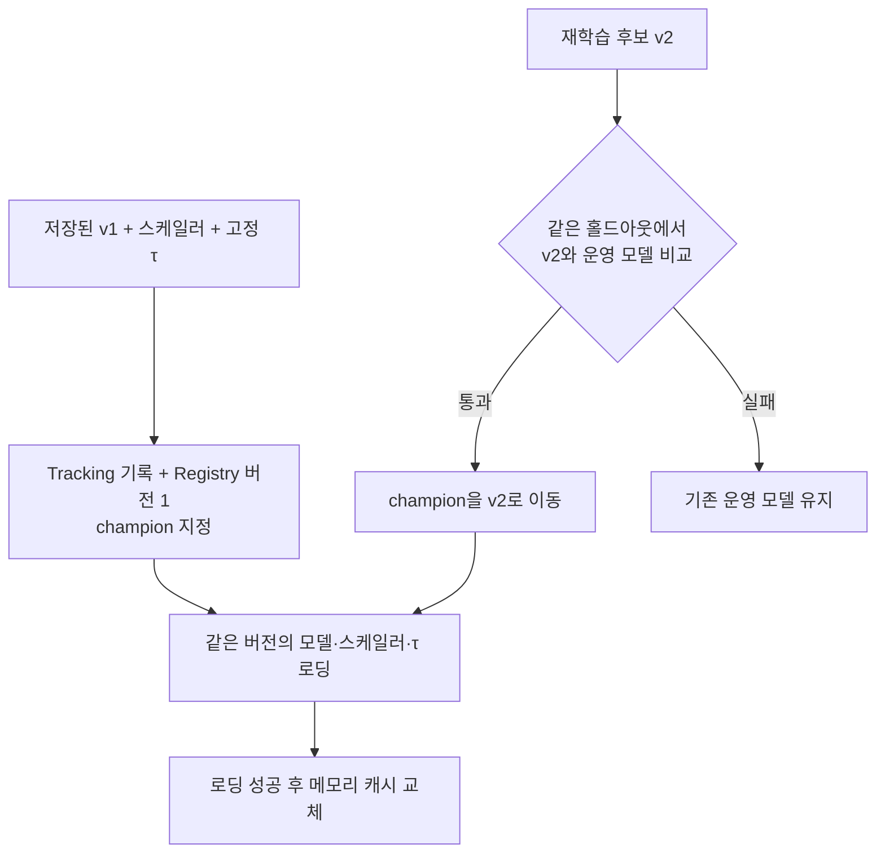

# 4단계: MLflow 기록, 기준 모델 등록, 배포 게이트

## 이번 단계의 결과

기존 `fraud_v1.keras`를 재학습하지 않고 MLflow에 기록하고 `CardFraudLSTM`의 버전 1로 등록했습니다. v1은 운영을 시작하는 기준 모델이므로 게이트 없이 `champion` 별칭을 받았습니다. 모델·스케일러·τ와 운영 기준이 같은 실행에 묶였습니다.

배포 게이트는 재학습한 후보(v2)를 내보내도 되는지 판단할 때만 사용합니다. 후보와 현재 운영 모델을 같은 홀드아웃에서 비교해 통과하면 `champion`을 후보로 옮기고, 실패하면 기존 운영 모델을 유지합니다.

## 기록부터 운영 선택까지



Tracking의 실행(run)은 설정과 지표를 기록하는 단위입니다. Registry 버전은 해당 모델을 번호로 찾아 쓸 수 있게 만든 보관 단위입니다. `champion`은 그중 현재 운영에 사용할 버전을 가리키는 별칭입니다.

수업의 Production 단계와 같은 선택 역할을 `champion` 별칭으로 구현했습니다. 설치된 MLflow 3.16에서 지원하는 별칭 API를 사용했습니다. [MLflow 공식 Registry 문서](https://mlflow.org/docs/latest/ml/model-registry/workflow/)

## 같은 버전에서 불러와야 하는 세 가지

| 구성품 | MLflow 저장 위치 | 필요한 이유 |
|---|---|---|
| LSTM 모델 | logged model | 거래 시퀀스에서 점수를 계산합니다 |
| 고정 스케일러 | 실행의 `bundle/scaler.pkl` | 학습할 때와 같은 숫자로 입력을 변환합니다 |
| τ·피처 순서·운영 기준 | 실행의 `bundle/settings.json` | 모델 점수를 판정으로 바꾸고 입력 순서를 확인합니다 |

로더는 운영 별칭을 조회해 버전 번호를 먼저 고정합니다. 이어서 그 버전의 모델과 같은 run의 bundle을 불러옵니다. 로딩 중 별칭이 바뀌더라도 모델과 τ가 서로 다른 버전에서 오지 않도록 했습니다.

`reload_model()`은 새 구성품을 전부 불러온 뒤 캐시를 교체합니다. 새 구성품을 읽다가 실패하면 기존 캐시가 유지됩니다. 서버는 분석할 때마다 `champion`이 가리키는 버전을 확인하고, 다른 버전으로 옮겨졌으면 다시 불러옵니다. 그래서 게이트를 통과한 후보는 서버 재시작 없이 다음 분석부터 쓰이고, 다시 불러오다 실패하면 기존 모델로 계속 판정합니다.

## 기준 모델 등록 규칙

`register_baseline()`은 운영 모델이 하나도 없을 때만 동작합니다. 이미 `champion`이 있으면 거부하므로, 그 뒤의 모든 새 모델은 `register_candidate()`로 게이트를 거쳐야 합니다. 반대로 `register_candidate()`는 비교할 운영 모델이 없으면 거부합니다.

## 게이트 조건

| 검사 | 통과 조건 |
|---|---|
| 평가 표본 | 최소 1,000건, 실제 이상거래 최소 20건, 정상 거래 존재 |
| Recall | 0.95 이상 |
| 경보 비율 | 6% 이하 — 업무 처리량에 대한 가정 |
| F2 | 현재 운영 모델 이상 |
| 입력 점수 | 0~1의 유한한 값, 정답과 같은 길이 |

후보와 현재 운영 모델은 같은 정답·입력에서 각각 자신의 τ로 평가합니다. τ는 게이트 데이터에서 다시 고르지 않습니다. 홀드아웃은 fine-tuning과 τ 선택에 쓰지 않은 최근 구간에서 떼어 둡니다.

이전 P_min 0.5696은 게이트에 사용하지 않습니다. 실제 Recall이 가정한 0.95보다 높으면 P_min을 통과하고도 경보가 6%를 넘을 수 있으므로, 경보 비율을 직접 검사합니다.

## 검증한 것

1. v1을 `champion`으로 등록한 뒤 `MODEL_SOURCE=mlflow`로 다시 불러와 2024년 상반기 검증 시퀀스 20,000건을 로컬 파일과 비교했습니다. 점수 최대 차이는 0이며 판정도 일치했습니다.
2. 게이트의 Recall·경보 경계값, F2 회귀, 다른 τ 사용, 표본 부족, 잘못된 점수, 운영 모델 없이 호출하면 거부되는지를 검증했습니다.
3. 합성 시험용 모델과 임시 DB로 운영 모델 없는 후보 거부, 기준 모델 등록과 중복 등록 거부, 실패 후보의 운영 교체 차단, 성공 후보 교체, 캐시 재로딩과 실패 시 캐시 유지를 검증했습니다. 합성 시험 모델은 실제 재학습한 v2가 아닙니다.
4. 같은 점수가 여러 번 나올 때 average precision을 점수 그룹 단위로 계산하도록 보완했습니다. 일정한 점수의 average precision이 사기율과 같고, 정답 정렬 순서에 영향을 받지 않는지 확인했습니다.

## 재현 명령

프로젝트 최상위 폴더에서, 데이터와 v1을 준비한 뒤 실행합니다.

```bash
python -m backend.serving_app.train_and_register
python -m unittest discover -s backend/tests -t . -v
```

첫 명령은 v1을 버전 1로 등록하고 `champion`으로 지정합니다. 결과는 `backend/logs/baseline-registration.json`과 MLflow run의 `registration.json`에 남습니다. 이미 운영 모델이 있는 저장소에서 다시 실행하면 거부합니다.

코드는 프로젝트의 절대 경로로 SQLite DB와 아티팩트 위치를 정합니다. 테스트에서는 `FRAUD_MLFLOW_DIR`로 임시 경로를 지정해 실제 운영 기록에 영향을 주지 않습니다.

## 이후 연결 (5단계)

이 단계의 장치는 이후 운영 감시와 연결했습니다(커밋 `dfabda7`). 감시가 재학습을 요청하면 `retrain.py`가 champion에서 fine-tune한 후보를 `register_candidate()`로 게이트에 올리고, 통과하면 champion이 옮겨져 서버가 다음 분석부터 새 모델을 씁니다. 2024년 하반기 6개월 시연에서 후보 v2·v3은 게이트에서 떨어졌고 v4가 통과해 교체됐습니다([설계 지표](설계지표.md) 7절, [시연 실행 로그](results/시연-실행-로그.txt)).
