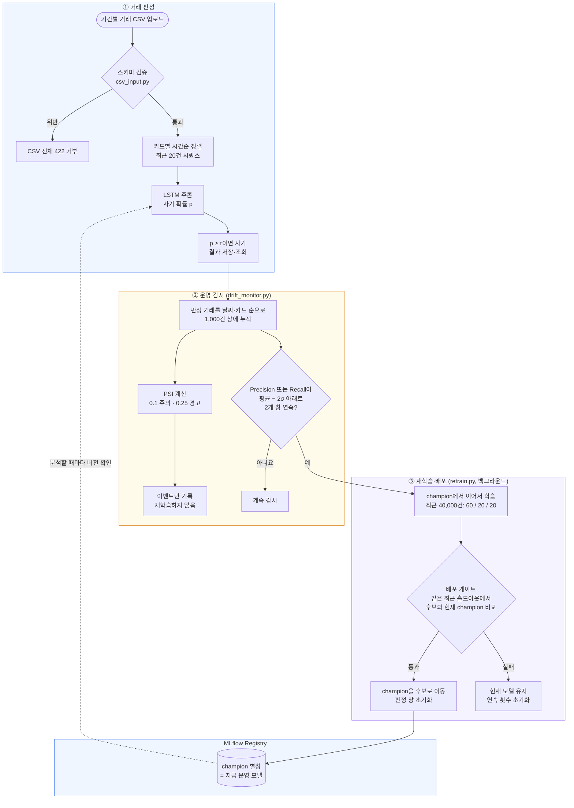

# 발표자 가이드

> 시스템을 직접 만들지 않은 팀원이 이 문서만 읽고 발표와 질의응답을 할 수 있도록 정리했습니다.
> 숫자마다 출처 파일을 붙였습니다. 저장소에 기록 파일이 없는 숫자(개발 중 실험)는 그렇게 표시했습니다.
> 작성 기준: 2026-10-08, 커밋 `a2590dd`(대시보드 감시 화면)와 그 뒤의 시연 스크립트(`backend/scripts/demo_docker.sh`)·재학습 상태 복구까지.
> 시연 결과의 1차 근거는 [시연 실행 로그](results/시연-실행-로그.txt)입니다. 발표 전에 한 번 읽어 두세요.

## 목차

1. [한 문장 요약과 AIOps가 필요한 이유](#1-한-문장-요약과-aiops가-필요한-이유)
2. [전체 구조와 CSV 한 개의 여정](#2-전체-구조와-csv-한-개의-여정)
3. [구성 요소별 설명](#3-구성-요소별-설명)
4. [핵심 설계 결정과 근거](#4-핵심-설계-결정과-근거)
5. [검증한 것과 아직 안 된 것](#5-검증한-것과-아직-안-된-것)
6. [시연 대본](#6-시연-대본)
7. [예상 질문과 답](#7-예상-질문과-답)
8. [용어집](#8-용어집)
9. [발표에서 피해야 할 표현](#9-발표에서-피해야-할-표현)

---

## 1. 한 문장 요약과 AIOps가 필요한 이유

### 한 문장 요약

**카드 거래 CSV를 올리면 카드별 최근 20건의 흐름을 LSTM이 읽어 이상거래를 판정하고, 모델이 조용히 나빠지는 순간을 감지해 재학습한 새 모델이 기준을 통과할 때만 운영 모델을 바꾸는 시스템입니다.**

6개월 시연에서 이 흐름이 끝까지 돌았습니다. 신종 사기가 들어온 10월에 v1의 Recall이 0.787로 떨어졌고, 재학습한 후보 v4가 게이트를 통과해 운영 모델이 됐습니다. 11·12월은 서버 재시작 없이 v4가 판정해 Recall 0.964·0.958을 냈습니다([시연 실행 로그](results/시연-실행-로그.txt)).

### 왜 AIOps가 필요한가: "서버는 멀쩡한데 모델은 틀린다"

일반 서버는 고장 나면 에러를 냅니다. 그래서 응답이 끊기면 바로 알 수 있습니다.
모델은 다릅니다. 입력이 바뀌거나 새 사기 수법이 나와도 서버는 200 응답을 계속 돌려줍니다. 숫자만 틀려질 뿐입니다.
그래서 사람이 따로 지켜보지 않으면 모델이 나빠진 것을 아무도 모릅니다.

시연의 10월이 정확히 이 상황입니다. 서버는 10월 CSV 39,646건을 평소처럼 판정해 돌려줬지만, 그 안에서 Recall은 0.787로 떨어져 있었습니다(시연 실행 로그). 감시가 없었다면 아무도 몰랐을 하락입니다.

같은 문제가 개발 중에도 여러 번 일어났습니다.

| 겪은 일 | 왜 위험했나 | 출처 |
|---|---|---|
| 가맹점 전월 매출의 음수 약 1,500건이 로그 변환에서 무한대가 되어, 검증 데이터에서 NaN이 471만 개 생겼습니다 | 에러 없이 학습이 진행될 수 있는 "조용한 실패"였습니다 | `docs/발표노트.md` 1절 |
| 서빙 쪽에서만 승인시간대를 문자열로 정렬해 "7"이 "15"보다 뒤에 놓였습니다 | 거래 순서가 뒤집혀도 서버는 정상 응답합니다 | `data/features.py` `sort_transactions()`, `docs/results/검증결과.md` |
| PSI가 해외·할부 비율이 1%에서 50%로 바뀌어도 0으로 나왔습니다 | 감시 장치 자체가 변화를 못 보는데도 "정상"으로 표시됩니다 | `docs/설계지표.md` 5-2절, `backend/tests/test_psi.py` |
| 감시가 연속 조건을 CSV 분석 끝에 한 번만 확인해, 10월에 기준 미달 창이 29개인데도 재학습을 요청하지 않았습니다 | 감시 장치가 켜져 있어도 조용히 놓칩니다 | `docs/설계지표.md` 5-3절, `docs/results/검증결과.md` |

`data/features.py` 맨 위 주석이 이 문제를 한 줄로 요약합니다. 학습과 서빙에서 입력을 만드는 방식이 조금이라도 다르면 서버는 정상 응답하면서 틀린 확률을 내놓습니다.

그래서 이 시스템은 세 가지를 합니다.

1. **들어오는 데이터를 막는다**: 잘못된 CSV는 모델에 닿기 전에 거부합니다.
2. **모델 성능을 지켜본다**: 분포 변화(PSI)와 실제 성능(Precision·Recall)을 따로 봅니다.
3. **바꿀 때는 시험을 본다**: 재학습한 모델은 배포 게이트를 통과해야만 운영에 올라갑니다.

---

## 2. 전체 구조와 CSV 한 개의 여정

### 전체 구조

모든 상자를 구현했고 6개월 시연으로 확인했습니다. 롤백(교체 직후 다시 나빠지면 이전 버전으로)만 미구현이라 그림에 넣지 않았습니다.



### CSV 한 개의 여정 (쉬운 말로)

시연에서 넣는 `2024-10.csv`(10월 거래 + 카드별 직전 19건 이력)를 올린다고 생각하면 됩니다.

| 단계 | 무슨 일이 일어나나 | 담당 파일 |
|---|---|---|
| 1. 업로드 | 사용자가 대시보드의 Datasets 탭이나 `POST /data/upload`로 CSV를 올립니다 | `routers/data.py` |
| 2. 입구 검사 | 필수 16개 컬럼, 날짜 형식, 코드값, 중복 거래를 검사합니다. 한 행이라도 틀리면 CSV 전체를 422로 돌려보내고, 처음 틀린 행 번호와 컬럼을 알려줍니다 | `data/csv_input.py` |
| 3. 보관 | 통과한 CSV를 저장하고 업로드 ID를 돌려줍니다. 모델이 없어도 저장은 됩니다 | `data/storage.py` |
| 4. 분석 요청 | `POST /predict/batch`에 업로드 ID와 기간(예: 2024-10-01 ~ 2024-10-31)을 보냅니다 | `routers/predict.py` |
| 5. 운영 모델 확인 | 서버가 MLflow에서 `champion`이 가리키는 버전을 확인합니다. 바뀌었으면 새 버전을 불러오고, 불러오다 실패하면 기존 모델로 계속 판정합니다 | `model_loader.py` `get_model()` |
| 6. 줄 세우기 | 카드별로 날짜 → 시간대(숫자) → 승인SEQ 순으로 정렬합니다 | `data/features.py` `sort_transactions()` |
| 7. 판정 대상 고르기 | 기간 안에 있고, 같은 카드의 직전 거래가 19건 이상 있는 거래만 판정합니다. 기간 앞의 이력 행은 시퀀스에만 씁니다. 모자라면 거부하지 않고 "제외"로 세어 결과에 표시합니다 | `batch_service.py` `prepare_batch()` |
| 8. 숫자로 바꾸기 | 거래 한 건을 숫자 17개(금액, 시간대, 해외 여부, 가맹점 특성, 할부, 카드 종류 등)로 바꾸고, 학습 때 저장한 스케일러로 0~1 범위에 맞춥니다 | `data/features.py` `encode()`, `FraudScaler` |
| 9. 20건 묶기와 추론 | 판정 대상 거래마다 "자기 포함 최근 20건"을 묶어 LSTM에 넣습니다. 4,096개씩 나눠 추론합니다 | `batch_service.py` `analyze_batch()` |
| 10. 판정 | 사기 확률이 τ 이상이면 사기로 표시합니다(v1은 0.28, v4는 0.16) | `batch_service.py` |
| 11. 성적 매기기 | CSV에 정답 컬럼(`이상거래여부`)이 있으면 정답이 있는 거래만으로 Precision·Recall·F2를 계산합니다 | `monitoring/metrics.py` `evaluate()` |
| 12. 결과 저장 | 거래별 결과 CSV와 요약 JSON을 저장합니다. 요약에는 모델 버전, τ, 판정·제외·경보 건수, 처리 시간이 들어갑니다 | `batch_service.py` |
| 13. 감시 기록 | 판정 거래를 날짜 → 카드 순으로 감시 기록에 이어 붙이고(이미 있는 거래는 건너뜀), 1,000건이 찰 때마다 창을 닫아 PSI와 Precision·Recall을 계산합니다. 10월 CSV는 창 40개를 닫았고 그중 Recall 기준 미달이 29개였습니다 | `monitoring/drift_monitor.py`, 시연 실행 로그 |
| 14. 재학습 요청 | 창을 닫을 때마다 2개 창 연속 미달인지 확인합니다. 10월은 120번째 창에서 조건을 채웠습니다. 서버는 분석 응답을 먼저 돌려주고, 재학습은 백그라운드에서 돕니다 | `drift_monitor.py`, `routers/predict.py`, `retrain.py` |
| 15. 게이트와 교체 | 후보 v4가 게이트를 통과해 champion이 v4로 옮겨졌습니다. 다음 분석(11월)부터 v4가 판정하고, 판정 창은 처음부터 다시 셉니다 | `train_and_register.py`, 시연 실행 로그 |

핵심은 **CSV 한 행 = 모델 입력 하나가 아니라는 점**입니다. CSV는 외부 입력 단위이고, 20건 시퀀스는 서버가 내부에서 만드는 모델 입력 단위입니다(`docs/현황과-남은작업.md` 1절).

---

## 3. 구성 요소별 설명

파일 경로는 저장소 최상위 기준입니다. `serving_app/`은 `backend/serving_app/`입니다.

### 3-1. 데이터와 전처리

| 구성 요소 | 하는 일 | 왜 필요한가 | 파일 |
|---|---|---|---|
| 데이터 준비 스크립트 | 원본 CSV를 합쳐 시간 기준으로 학습·검증·운영 구간으로 나누고, 스케일러를 학습 기간으로 한 번만 fit해 저장합니다 | 제공된 Training/Validation이 같은 기간에서 무작위로 나뉘어 있어 그대로 쓰면 미래 정보가 학습에 섞이기 때문입니다 | `backend/scripts/prepare_data.py` |
| 공용 전처리 | 거래를 숫자 17개로 바꾸는 규칙과 정렬 규칙, 20건 묶기 규칙을 한 곳에 둡니다 | 학습과 서빙이 같은 함수를 써야 "조용히 틀리는" 일이 없기 때문입니다 | `data/features.py` |
| CSV 입구 검사 | 컬럼·값·코드·중복을 검사하고 위반 시 422로 거부합니다 | 잘못된 값이 전처리에서 0으로 덮이기 전에 막아야 하기 때문입니다 | `data/csv_input.py` |

**비유**: 공용 전처리는 "같은 자(ruler)"입니다. 학습 때 cm 자로 재고 서빙 때 inch 자로 재면 숫자는 나오지만 의미가 없습니다. 그래서 자를 하나만 만들어 양쪽이 같이 씁니다.

### 3-2. 모델

| 항목 | 내용 | 출처 |
|---|---|---|
| 구조 | LSTM 32 → LSTM 32 → LSTM 16 → Dense 16(relu) → Dense 1(sigmoid). LSTM 층 구성은 수업(HAIC) 스켈레톤을 유지했습니다 | `backend/serving_app/lstm_model.py` |
| 바꾼 것 | HAIC는 종가를 맞히는 회귀(mse)였고, 여기서는 사기 확률을 내야 하므로 sigmoid와 binary crossentropy로 바꿨습니다 | `lstm_model.py` 주석 |
| 입력 | 같은 카드의 최근 20건 × 피처 17개. 마지막 거래를 판정합니다 | `data/features.py` |
| 학습 | 2021~2023년 시퀀스 1,436,555개, 최대 15 epoch, 15 epoch까지 갔고 505초 걸렸습니다 | `docs/발표노트.md` 2절 |

**왜 LSTM인가**: 직전 거래가 이상거래였으면 이번 거래도 이상거래일 비율이 42.9%이고, 직전이 정상이면 2.2%입니다. 가장 많은 사기 유형(카드 위변조, 44.6%)은 정의 자체가 "최근 거래 패턴에 비해 금액 급증"이고, 실제 금액이 직전 10건 평균의 6.13배였습니다(`docs/데이터분석.md` 5절). 그래서 거래 한 건만 보는 모델보다 순서를 읽는 모델이 유리합니다.

### 3-3. 판정 기준점 τ

| 항목 | 내용 | 출처 |
|---|---|---|
| 역할 | 모델은 확률만 냅니다. 몇 % 이상을 사기로 볼지 정하는 합격선이 τ입니다 | `docs/설계지표.md` 3절 |
| 값 | v1은 0.28. 시연에서 교체된 v4는 0.16 | `thresholds.json`, 시연 실행 로그 |
| 정하는 법 | τ를 0.01 간격으로 바꿔 가며 F2가 가장 높은 값을 고릅니다. v1은 2024년 상반기 데이터로, 재학습 후보는 재학습 데이터의 τ 구간(20%)으로 고릅니다 | `monitoring/metrics.py` `best_threshold()`, `retrain.py` |
| 보관 | 모델 버전마다 τ가 다르므로 MLflow에 모델과 함께 저장합니다. 모델이 바뀌면 τ도 같이 바뀝니다 | `docs/4단계-MLflow와-배포게이트.md` |

### 3-4. MLflow Registry와 `champion`

| 구성 요소 | 하는 일 | 파일 |
|---|---|---|
| Registry | 모델을 버전 번호로 보관합니다. 모델 이름은 `CardFraudLSTM`입니다. 게이트에서 떨어진 후보도 버전으로 남습니다 | `serving_app/registry.py`, `train_and_register.py` |
| `champion` 별칭 | "지금 운영 중인 버전"을 가리키는 이름표입니다. 시작은 버전 1(v1)이고, 시연에서는 10월에 버전 4로 옮겨졌습니다 | `registry.py`, 시연 실행 로그 |
| 묶음 보관 | 모델, 스케일러(`scaler.pkl`), τ·피처 순서·운영 기준(`settings.json`)을 같은 실행(run)에 묶어 둡니다 | `train_and_register.py`, `model_loader.py` |
| 로더 | `champion`이 가리키는 버전 번호를 먼저 고정한 뒤 그 버전의 세 구성품을 함께 불러옵니다. 다 불러온 뒤에만 캐시를 교체하므로, 실패하면 기존 모델이 그대로 남습니다 | `serving_app/model_loader.py` |

**비유**: `champion`은 "현재 근무 중" 명찰입니다. 새 직원이 들어와도 명찰을 옮겨 달기 전까지는 기존 직원이 일합니다. 서버는 분석을 시작할 때마다 명찰이 누구에게 있는지 확인하므로, 명찰만 옮기면 서버를 껐다 켜지 않아도 다음 분석부터 새 직원이 일합니다.

**왜 모델·스케일러·τ를 같이 묶나**: 새 모델에 옛 τ를 쓰거나, 옛 스케일러로 바꾼 숫자를 새 모델에 넣으면 또 "조용히 틀리는" 상황이 됩니다. v4의 τ가 0.16으로 v1의 0.28과 크게 다르다는 점이 이 묶음이 필요한 이유를 보여 줍니다.

### 3-5. 배포 게이트

| 항목 | 내용 | 파일 |
|---|---|---|
| 역할 | 재학습한 후보를 운영에 올려도 되는지 판단합니다. **v1에는 쓰지 않았습니다** | `monitoring/deployment_gate.py` |
| 방식 | 후보와 현재 `champion`을 **같은 최근 홀드아웃**에서 각자 자기 τ로 채점합니다 | `deployment_gate.py` `check_gate()` |
| 통과 조건 | 아래 표의 조건을 **모두** 만족해야 합니다 | 같은 파일 |
| 통과 시 | `champion`을 후보로 옮깁니다 | `train_and_register.py` `register_candidate()` |
| 실패 시 | 후보도 Registry에 버전으로 남지만 `gate_passed=false` 태그가 붙고, `champion`은 그대로입니다 | `train_and_register.py`, `backend/tests/test_registry_integration.py` |
| 시연에서 | 후보 3개를 심사해 v2·v3은 떨어지고 v4가 통과했습니다 | 시연 실행 로그 |

| 게이트 조건 | 기준 | 출처 |
|---|---|---|
| 평가 표본 | 1,000건 이상, 실제 이상거래 20건 이상, 정상 거래 존재 | `deployment_gate.py` `MIN_SAMPLES`, `MIN_FRAUDS` |
| 성능 회귀 없음 | F2(후보) ≥ F2(현재 champion) | `deployment_gate.py` |
| Recall 하한 | 0.95 이상 | `thresholds.json` `gate.r_min` |
| 경보 비율 상한 | 6% 이하 (탐지팀 처리량 가정) | `thresholds.json` `gate.alert_cap` |
| 입력 점수 | 0~1의 유한한 값, 정답과 같은 길이. NaN·무한대는 거부 | `deployment_gate.py` `validate_predictions()` |

추가 안전장치가 두 개 있습니다(`train_and_register.py`).

- 후보와 운영 모델의 스케일러가 다르면 비교 자체를 거부합니다.
- 평가하는 사이에 `champion`이 다른 버전으로 바뀌었으면 교체하지 않고 오류를 냅니다.

**비유**: 배포 게이트는 "승진 심사"입니다. 지금 일하는 사람과 후보에게 **같은 시험지**를 주고, 후보가 현직자보다 못하지 않고(F2), 사기를 95% 이상 잡고(Recall), 탐지팀이 감당 못 할 만큼 경보를 울리지 않을 때(6%)만 자리를 바꿉니다.

### 3-6. CSV 서버와 대시보드

| 구성 요소 | 하는 일 | 파일 |
|---|---|---|
| FastAPI 앱 | 라우터 조립, CORS, 시작 시 로딩 방식(Lazy/Eager) | `serving_app/main.py` |
| 주요 API | `/data/upload`, `/predict/batch`, `/predict/results/...`, `/monitoring/status`, `/health`, `/metrics/summary`, `/logs` | `serving_app/routers/`, `docs/API명세.md` |
| 대시보드 | 서버 루트(`/`)에서 제공. Dashboard·Analysis·Datasets·System 탭 | `frontend/index.html`, `frontend/README.md` |
| 요청 로그·지표 | 요청 수, 평균 응답시간, 5xx 비율 | `monitoring/logger.py`, `routers/metrics.py` |
| Docker | 기본 `api` 이미지(모델 없이 업로드·조회만, 분석은 503)와 실제 판정용 `model-runtime` 이미지 | `serving_app/Dockerfile`, `docker-compose.yml` |
| 환경변수 `MODEL_SOURCE` | 기본값 `mlflow`(champion 사용). `local`은 등록 전 v1 파일을 직접 읽을 때만 쓰며, 이때 재학습은 실패로 끝납니다 | `serving_app/config.py`, `retrain.py` |

시연 때 가리킬 화면은 다음과 같습니다(`frontend/README.md`).

| 화면 | 보여 주는 것 |
|---|---|
| Dashboard › 데이터 분포 (PSI) | 가장 최근 창의 번호·기간, 정상 / 주의 / 경고 배지, 대상별 PSI(금액·시간대·해외·가맹점 매출·할부·사기 확률), "PSI는 알림만" 안내 |
| Dashboard › CSV 배치 분석 파이프라인 | 마지막 세 단계가 실시간 상태를 보여 줍니다. 감시 「창 N개」, fine-tuning 「재학습 중」/「후보 vN」, 배포 게이트 「통과 · 교체」/「미달 · 유지」/「실패」 |
| Dashboard › 운영 감시 · 재학습 | 운영 모델 버전, 누적 판정·창 수, 연속 미달 횟수, 재학습 상태. 최근 창 10개 표(보류 회색, 미달 주황, 재학습을 요청한 창은 강조). 이벤트 목록(재학습 요청, 게이트 결과와 후보·운영 모델 비교, 운영 모델 교체·판정 창 초기화). 재학습 중에는 3초마다 새로 고침 |
| Analysis › 분석 결과 › 운영 감시 | 이번 분석으로 닫힌 창 수, 대기·중복 제외 건수, 기준 미달 창 수, PSI 주의·경고 창 수, "N번째 창에서 recall이 2개 창 연속 기준 미달 → 재학습을 요청" |
| System › 운영 감시 기준 | 창 크기, 판정 보류 조건, 트리거 기준값, 연결 상태 「CSV 분석마다 적용」 |

### 3-7. 운영 감시

| 항목 | 동작 | 출처 |
|---|---|---|
| 기록 | CSV 분석이 끝나면 판정 거래를 날짜 → 카드 순으로 `monitoring/observations.csv`에 이어 붙입니다. 같은 카드·날짜·시간대·승인SEQ가 이미 있으면 건너뜁니다 | `batch_service.py`, `drift_monitor.py` |
| 창 | 누적 1,000건마다 창 하나를 닫습니다. 창은 겹치지 않고, 남은 건수는 다음 CSV로 이어집니다 | `drift_monitor.py`, `thresholds.json` `trigger.window_size` |
| PSI | 창마다 승인 금액, 승인 시간대, 해외 여부, 가맹점 매출 구간, 할부 여부, 사기 확률의 PSI를 계산합니다. 하나라도 0.1 이상이면 주의, 0.25 이상이면 경고 이벤트만 남깁니다 | `drift_monitor.py`, `docs/설계지표.md` 5-2절 |
| 판정 보류 | 창 안의 경보가 30건 미만이면 Precision을, 실제 사기가 20건 미만이면 Recall을 판정하지 않습니다. 보류된 창은 연속 횟수를 늘리지도 초기화하지도 않습니다 | `thresholds.json` `trigger.min_alerts`, `min_frauds` |
| 재학습 요청 | 창을 닫을 때마다 Precision 또는 Recall이 평균 − 2σ(0.6290 / 0.8632) 아래로 2개 창 연속인지 확인하고, 충족한 창에서 바로 요청합니다. 재학습이 요청·실행 중이면 새로 요청하지 않습니다 | `drift_monitor.py`, `thresholds.json` |
| 모델 교체 후 | champion이 바뀌면 이전 기록을 `observations-v1.csv`처럼 보관하고 판정 창을 처음부터 다시 셉니다. 재학습 전 예측이 창에 남아 있으면 바로 다시 드리프트로 판정되기 때문입니다 | `drift_monitor.py`, `docs/설계지표.md` 6절 |
| 재시작 복구 | 재학습 도중 서버가 꺼지면 상태가 「요청됨/실행 중」으로 남아 다시는 재학습을 요청하지 못합니다. 그래서 서버가 시작할 때 이 상태를 「실패(서버 재시작으로 중단)」로 바꾸고 이벤트를 남기며, 연속 미달 횟수를 비웁니다 | `drift_monitor.py` `recover_interrupted_retrain()`, `main.py` |
| 조회 | `GET /monitoring/status`, 분석 응답의 `monitoring`, 대시보드 | `routers/monitoring.py`, `docs/API명세.md` 10절 |

**비유**: PSI는 "손님 구성이 달라졌다"는 체온계이고, Precision·Recall은 "실제로 오진이 늘었다"는 진단 결과입니다. 체온이 조금 올랐다고 바로 수술(재학습)하지 않고, 진단 결과가 두 번 연속 나쁠 때만 수술합니다.

**왜 날짜 → 카드 순인가**: 기준값을 잴 때(`measure_v1.py`)도 날짜 순으로 1,000건씩 잘랐습니다. 처음에 날짜 → 시간대 순으로 묶었더니 창 하나가 몇 시간치 거래만 담아, 시간대 분포가 평소와 달라 보이고 정상 데이터에서도 PSI가 울렸습니다. 기준을 잰 방식과 감시하는 방식을 맞춰 고쳤습니다(`batch_service.py` 주석, `docs/설계지표.md` 5-3절).

### 3-8. 재학습

| 항목 | 동작 | 출처 |
|---|---|---|
| 시작점 | 처음부터 학습하지 않고 현재 `champion`의 가중치에서 이어서 학습(fine-tune)합니다 | `retrain.py` |
| 데이터 | 현재 champion이 판정한 거래 중 정답이 있는 최근 40,000건. 업로드 원본에서 20건 시퀀스를 다시 만듭니다 | `retrain.py` `labelled_sequences()` |
| 나누기 | 시간순으로 앞 60%(24,000건)는 fine-tune, 다음 20%(8,000건)는 τ 선택, 마지막 20%(8,000건)는 게이트 홀드아웃. 같은 거래는 두 구간에 들어가지 않습니다. 시간순 건수로 나누므로 경계일 하루는 두 구간에 나뉠 수 있습니다 | `retrain.py` `split_by_time()`, `tests/test_monitoring.py` |
| 왜 40,000건인가 | 2024년 하반기 한 달 분량입니다(시연 월별 판정 36,629~40,324건). 범위를 더 넓히면 앞쪽 60%가 드리프트 이전 데이터로 채워져 후보가 새 패턴을 배우지 못합니다 | `retrain.py` 주석, 시연 실행 로그 |
| 데이터가 모자라면 | 홀드아웃이 1,000건 또는 이상거래 20건에 못 미치면 게이트가 후보를 거부하고 현재 모델이 유지됩니다 | `deployment_gate.py` |
| 학습 설정 | 학습률 1e-3, 3 epoch, 배치 512. 시뮬레이션 10월 데이터의 τ 구간 F2로 골랐고 홀드아웃은 보지 않았습니다 | `retrain.py` |
| 재현성 | seed 42와 TensorFlow 연산 결정성을 고정합니다. 같은 데이터면 같은 후보가 나옵니다 | `retrain.py` `fine_tune()` |
| 기준 승계 `[가정]` | 후보는 v1의 트리거 기준(평균 − 2σ), 거래 피처의 PSI 기준 분포, 게이트 기준을 그대로 이어받습니다. 사기 확률의 PSI 기준만 후보의 τ 구간 점수로 다시 잽니다. 한계: 후보의 정상 흔들림이 v1과 다르면 −2σ 기준이 맞지 않을 수 있습니다 | `retrain.py`, `docs/설계지표.md` 6절 |
| 스케일러 | 학습 때 저장한 `scaler.pkl`을 그대로 씁니다 | `retrain.py` |
| 실행 위치 | 분석 응답을 먼저 돌려준 뒤 FastAPI BackgroundTasks에서 실행합니다. 한 번에 하나만 돌립니다 | `routers/predict.py`, `retrain.py` |
| 결과 | 통과하면 champion이 옮겨지고 서버가 새 모델을 불러옵니다. 실패하면 현재 모델을 유지하고 연속 횟수를 비웁니다. 오류가 나면 `retrain_failed` 이벤트를 남기고 현재 모델을 유지합니다 | `retrain.py`, `drift_monitor.py` |

학습 설정을 고른 과정(개발 중 실험, 저장소에 결과 파일 없음): τ 구간에서만 비교했습니다. 학습률 1e-4·10 epoch는 Recall 0.909 / F2 0.835, 1e-3·3 epoch는 0.9455 / 0.9039, 1e-3·5 epoch는 0.9381 / 0.9011, 1e-3·10 epoch는 0.9431 / 0.8969였습니다. 그래서 1e-3·3 epoch를 택했습니다.

---

## 4. 핵심 설계 결정과 근거

### 4-1. 정확도 대신 Precision·Recall

| 근거 | 출처 |
|---|---|
| 이상거래 비율이 약 3.7%라서 모든 거래를 정상으로 찍어도 정확도 96.3%가 나옵니다. 사기를 한 건도 못 잡는 모델이 높은 점수를 받으므로 정확도는 어떤 판단에도 쓰지 않습니다 | `docs/설계지표.md` 1절 |
| 전체 1,952,871건 중 이상거래 72,008건, 3.69% | `docs/데이터분석.md` 1절 |

### 4-2. F2 (β = 2)

F-beta의 β는 "Recall을 Precision보다 몇 배 중요하게 볼지"입니다. 사기를 놓친 손해가 정상 고객을 잘못 막은 손해보다 크기 때문에 Recall 쪽에 무게를 둡니다.

| 근거 | 값 | 출처 |
|---|---|---|
| 사기 1건 평균 승인 금액 | 1,040,459원 | `thresholds.json` `amount.fraud_mean`, `docs/설계지표.md` 4-1절 |
| 정상 거래 평균 승인 금액 | 24,893원 (약 42배 차이) | 같은 곳 |
| β 1 → 2 | 정상 고객 2.3명을 더 확인하는 대가로 사기 1건을 더 잡습니다 | `docs/설계지표.md` 4-1절 (`backend/scripts/compare_beta.py`) |
| β 2 → 3 → 4 → 5 | 대가가 6.5명 → 13.0명 → 20.4명으로 빠르게 커집니다 | 같은 곳 |
| 경보 여유 | β=2의 경보 비율 4.45%는 상한 6%까지 1.55%p 여유. β=3은 0.85%p, β=4는 0.44%p, β=5는 6.11%로 상한 초과 | 같은 곳 |

β 비교 전체 표(2024년 상반기 235,562건, 실제 사기 8,475건, `docs/설계지표.md` 4-1절):

| β | τ | Recall | Precision | 경보 비율 | 놓친 사기 | 잘못 막은 정상 |
|---|---|---|---|---|---|---|
| 1 | 0.49 | 0.898 | 0.849 | 3.81% | 862 | 1,357 |
| **2** | **0.28** | **0.952** | **0.770** | **4.45%** | **408** | **2,409** |
| 3 | 0.16 | 0.978 | 0.683 | 5.15% | 188 | 3,849 |
| 4 | 0.11 | 0.986 | 0.638 | 5.56% | 120 | 4,732 |
| 5 | 0.06 | 0.993 | 0.585 | 6.11% | 59 | 5,979 |

**주의**: β는 "점수가 가장 높은 β"로 고를 수 없습니다. β마다 자기 기준에서는 항상 최고점이 나오기 때문입니다. 그래서 얻는 것(더 잡은 사기)과 잃는 것(더 막은 정상 고객)을 비교해 정했습니다.

### 4-3. τ = 0.28과 v1 성능

v1을 학습에 쓰지 않은 2024년 상반기에 돌린 결과입니다(`thresholds.json` `valid`, `docs/설계지표.md` 8절).

| 지표 | 값 |
|---|---|
| τ (F2 최대) | 0.28 |
| F2 | 0.9089 |
| Recall | 0.9519 |
| Precision | 0.7700 |
| PR-AUC | 0.9419 (아무것도 학습하지 않은 기준선 0.0360) |
| 경보 비율 | 4.45% |

### 4-4. 배포 게이트 수치

| 기준 | 값 | 근거 | 출처 |
|---|---|---|---|
| Recall 하한 | 0.95 | v1 Recall 0.9519를 소수 둘째 자리에서 내린 값입니다. 출시 때보다 사기를 더 놓치는 모델은 내보내지 않습니다 | `docs/설계지표.md` 4-2절, `thresholds.json` |
| 경보 비율 상한 | 6% | 탐지팀 처리량에 대한 **가정**입니다. 실제 인력으로 확인한 숫자가 아닙니다 | `docs/설계지표.md` 4-2절, `backend/README.md` |
| F2 회귀 없음 | F2(후보) ≥ F2(현재 champion) | 같은 데이터로 비교하므로 이상거래 비율 차이가 결과에 끼어들지 않습니다 | `docs/설계지표.md` 4-2절 |
| 최소 표본 | 1,000건, 사기 20건 | HAIC 스켈레톤처럼 41행을 8:2로 나누면 검증 샘플이 5개뿐이라 결과가 우연에 좌우됩니다. 시연의 홀드아웃은 매번 8,000건, 사기 222~341건이었습니다 | `docs/설계지표.md` 4-3절, 시연 실행 로그 |

예전에는 경보량을 Precision 하한(P_min 0.5696)으로 간접 제한했습니다. 그런데 실제 Recall이 0.95보다 높으면 P_min을 통과하고도 경보가 6%를 넘을 수 있었습니다. β=5의 경보 비율 6.11%가 그 사례입니다. 그래서 경보 비율을 직접 검사하고 P_min은 참고값으로만 남겼습니다(`docs/설계지표.md` 4-2절).

### 4-5. 드리프트 트리거: 평균 − 2σ, 2개 창 연속

| 결정 | 근거 | 출처 |
|---|---|---|
| 창 크기 1,000건 | HAIC처럼 21건씩 보면 사기율 3.7%에서 창에 사기가 평균 1건도 안 들어가 Recall을 계산할 수 없습니다. 1,000건이면 평균 37건 정도 들어갑니다 | `docs/설계지표.md` 5-3절 |
| 고정 비율 대신 −2σ | 모델이 멀쩡해도 창마다 점수가 흔들립니다. 정상 창 Precision의 표준편차가 0.0702였으므로 "20% 하락" 같은 고정 기준은 정상적인 흔들림에도 울립니다 | `docs/설계지표.md` 5-3절, `thresholds.json` |
| Precision 기준 | 0.6290 (정상 창 224개 평균 0.7694 − 2 × 0.0702) | `thresholds.json` `trigger.precision` |
| Recall 기준 | 0.8632 (정상 창 232개 평균 0.9506 − 2 × 0.0437) | `thresholds.json` `trigger.recall` |
| 2개 창 연속 | 2024년 상반기 정상 데이터 1,000건 창 235개에서 기준 아래로 떨어진 창이 13개 있었지만 연속으로 떨어진 적은 없었습니다. 한 번 튄 값으로 재학습하면 비용만 듭니다 | `docs/설계지표.md` 5-4절 |
| −1σ를 버린 이유 | 같은 정상 기간에 −1σ는 기준 미달 창 58개, 잘못된 재학습 15회. −2σ는 13개, 0회 | `docs/설계지표.md` 5-4절 |
| 창마다 확인 | 연속 조건을 CSV 분석 끝에 한 번만 보면 뒤쪽 정상 창이 횟수를 지웁니다. 실제로 10월(미달 창 29개)이 그렇게 놓쳤다가 고쳤습니다 | `drift_monitor.py`, `tests/test_monitoring.py` |

정상 창 개수가 235개인데 Precision은 224개, Recall은 232개인 이유는 판정 보류 때문입니다. 경보가 30건 미만인 창은 Precision을, 사기가 20건 미만인 창은 Recall을 계산하지 않았습니다(`backend/scripts/measure_v1.py` `window_stats()`).

**Precision과 Recall을 둘 다 보는 이유**: 모델이 신종 사기를 알아보지 못하면 그 거래는 사기로 표시되지 않습니다. 표시되지 않은 거래는 Precision 계산에 들어가지 않으므로 신종 사기는 Recall에서만 드러납니다. 시연 10월이 그랬습니다. Precision은 0.775로 평소 수준이었고 Recall만 0.787로 떨어졌습니다(시연 실행 로그).

### 4-6. PSI는 알림만

| 근거 | 출처 |
|---|---|
| 거래 모양이 바뀌었다고 모델 성능이 반드시 떨어지지는 않습니다. 명절처럼 소비만 늘어난 경우가 그렇습니다 | `docs/설계지표.md` 5-1절 |
| 원래는 PSI 경고 중에 트리거를 −1σ로 좁히려 했습니다. 그런데 −1σ는 정상 기간에도 재학습을 15번 일으켰으므로 이 규칙을 뺐습니다 | `docs/설계지표.md` 5-4절 |
| PSI와 성능 지표는 단위가 달라 가중합으로 섞기 어렵고, 가중치를 맞출 실제 드리프트 사례도 없습니다 | `docs/설계지표.md` 5-4절 |
| 0.1과 0.25는 신용평가 분야의 관례값입니다 | `docs/설계지표.md` 5-2절 |
| 정상 창의 PSI 최댓값은 0.079(승인 시간대)로 주의 기준 0.1 미만이었습니다 | `thresholds.json` `psi.normal_window_max` |
| 시연 9월: 명절 주입 기간에 PSI 경고 창이 8개 생겼지만, 명절 때문에 재학습하지는 않았습니다 | 시연 실행 로그, `docs/설계지표.md` 7절 |

상황별로 정리하면 다음과 같습니다(`docs/설계지표.md` 5-4절).

| 상황 | PSI | Precision | Recall | 결과 | 시연에서 |
|---|---|---|---|---|---|
| 평상시 | 정상 | 정상 | 정상 | 없음 | 8월 |
| 명절 소비 증가 | 상승 | 정상 | 정상 | 알림만 | 9월 명절 주간 |
| 정상 고객 패턴 변화로 오탐 증가 | 상승 | 하락 | 정상 | 재학습 | 장면 없음 |
| 신종 사기 등장 | 상승 | 정상 | 하락 | 재학습 | 10월 |

교수님이 수업에서 "추석처럼 물량이 커지면 RMSE만으로는 드리프트로 잘못 판단한다"는 문제를 제기했습니다. 이 설계는 거래 모양만 바뀌고 성능은 그대로면 재학습하지 않으므로 같은 문제를 피합니다(`docs/설계지표.md` 5-4절).

### 4-7. 시간순 분할

| 기간 (데이터에 기록된 거래 시점) | 용도 | 시퀀스 수 | 출처 |
|---|---|---|---|
| 2021~2023 | v1 학습, 스케일러 fit | 1,436,555 | `docs/발표노트.md` 1절 |
| 2024년 상반기 | τ 선택, β 비교, 감시 기준 측정 | 235,562 | 같은 곳 |
| 2024년 하반기 | 운영 시연. 재학습 시 최근 40,000건을 fine-tune·τ 선택·홀드아웃으로 시간순으로 나눔 | 231,897 | 같은 곳, `retrain.py` |

**이유**: AI Hub가 제공한 Training/Validation은 같은 2021~2024 기간에서 무작위로 나뉘어 있었고, Validation 카드 2,577장이 모두 Training에도 있었습니다(`docs/데이터분석.md` 2절). 그대로 쓰면 모델이 미래 거래를 보고 학습하게 됩니다. 그래서 두 파일을 합친 뒤 시간 기준으로 다시 나눴습니다. 이 기간 구분은 성능을 확인하기 전에 고정했습니다(`docs/설계지표.md` 4-3절).

### 4-8. τ 선택 데이터와 게이트 시험지 분리

τ를 고른 데이터로 다시 합격 여부를 판단하면 점수가 낙관적으로 나옵니다(`docs/설계지표.md` 4-3절). 모의고사 문제를 보고 커트라인을 정한 뒤 같은 문제로 합격을 판정하는 셈입니다. 그래서 게이트는 τ를 다시 고르지 않고, 각 모델이 이미 가진 τ로 채점합니다. 재학습도 fine-tune 60%, τ 선택 20%, 홀드아웃 20%를 시간순 건수로 나눕니다. 같은 거래는 두 구간에 들어가지 않습니다. 시간순 건수로 나누므로 경계일 하루는 두 구간에 나뉠 수 있습니다(`retrain.py`, `tests/test_monitoring.py`). 10월 재학습을 예로 들면 fine-tune 9/30~10/19, τ 10/19~10/25, 홀드아웃 10/25~10/31이었고, 10/19와 10/25의 거래는 두 구간에 나뉘어 들어갔습니다(시연 실행 로그).

홀드아웃을 **최근** 구간에서 뽑는 이유는, 과거 데이터로만 평가하면 새 패턴에 적응한 후보의 장점이 드러나지 않기 때문입니다(`docs/설계지표.md` 4-3절).

### 4-9. 고정 스케일러

스케일러를 다시 fit하면 같은 금액이 다른 숫자로 들어가 기존 가중치와 어긋납니다(`docs/설계지표.md` 6절, `data/features.py` `FraudScaler` 주석). 그래서 학습 기간으로 한 번만 fit해 저장하고, 서빙과 재학습 모두 그 파일을 그대로 씁니다. 게이트는 후보와 운영 모델의 스케일러가 다르면 비교를 거부합니다(`train_and_register.py`).

### 4-10. `champion` 별칭과 v1 등록 방식

| 결정 | 근거 | 출처 |
|---|---|---|
| Production 단계 대신 `champion` 별칭 | 설치된 MLflow 3.16이 지원하는 별칭 API로 수업의 Production 단계와 같은 역할을 구현했습니다 | `docs/4단계-MLflow와-배포게이트.md` |
| v1은 게이트 없이 등록 | 게이트는 "현재 운영 모델과 비교"하는 장치인데, v1 이전에는 비교할 운영 모델이 없습니다. v1이 운영을 시작하는 기준 모델입니다 | `docs/설계지표.md` 4-2절 |
| 기준 등록은 한 번만 | `register_baseline()`은 champion이 이미 있으면 거부합니다. 그 뒤의 모든 새 모델은 `register_candidate()`로 게이트를 거쳐야 합니다 | `train_and_register.py`, `docs/4단계-MLflow와-배포게이트.md` |

---

## 5. 검증한 것과 아직 안 된 것

### 5-1. 검증한 것 (숫자 근거 있음)

| 검증 내용 | 결과 | 출처 |
|---|---|---|
| **6개월 운영 시연** | 정상 → 명절 → 신종 사기 순서로 7~12월 CSV를 넣어 감시 → 재학습 → 게이트 → 교체가 끝까지 동작했습니다. 아래 5-2 표 참고 | `docs/results/시연-실행-로그.txt`, 커밋 `2fea235` |
| **명절은 알림만** | 9월 PSI 경고 창 8개(명절 주입 기간 9/13~9/19의 창 97~104, 금액 PSI 1.548~1.582), Recall 0.928로 유지. 이 창들에서는 재학습 요청이 없었습니다 | 시연 실행 로그, `docs/results/시연-감시-기록/windows-v1.jsonl` |
| **신종 사기 → 교체** | 10월 v1 Recall 0.787, 기준 미달 창 29개 → 120번째 창에서 요청 → 후보 v4 통과 → 11·12월 v4가 재시작 없이 판정(Recall 0.964·0.958) | 시연 실행 로그 |
| **게이트가 나쁜 후보를 막음** | 7월 후보 v2(Recall 0.923)와 9월 후보 v3(Recall 0.930, F2 회귀)이 떨어지고 v1이 계속 판정했습니다 | 시연 실행 로그 |
| **감시 단위 테스트** | 창 닫기, 판정 보류 시 횟수 유지, 두 번째 연속 미달 창에서 요청, 대기 중 중복 요청 없음, 미달 후 초기화, 중복 거래 제외, 모델 교체 시 초기화·보관, PSI 경고는 재학습 없음, 40,000건 시간순 분할 | `backend/tests/test_monitoring.py` |
| **재학습 통합 테스트** | 합성 모델과 임시 저장소로 `retrain.run` 한 번을 돌려, 통과 경로(champion 이동 → 서버가 새 버전 사용 → 다음 분석에서 감시 초기화·이전 기록 보관)와 미달 경로(champion 유지, 상태 `rejected`, 연속 횟수 0)를 확인 | `backend/tests/test_retrain_integration.py` |
| **자동 테스트 전체** | 45개 통과(CSV/API 15, 배포 게이트 9, 판정 창 감시·시간 분할 8, 분석 API 감시 연결·재시작 복구 7, PSI 3, 재학습 통합 2, Registry 흐름 1) | `docs/results/검증결과.md` |
| **학습·서빙 전처리 일치** | 원본 CSV 32개를 서버와 같은 경로(`parse_csv` → 정렬 → `encode` → 저장된 스케일러 → 20건 묶기)로 변환해 학습 입력과 비교했습니다. 거래 1,952,871건, 시퀀스 1,281,085개에서 최대 차이 0. 분기 파일 32개를 업로드처럼 파일마다 따로 변환해 파일별로 카드의 첫 19건이 빠지므로, 전체를 합친 시퀀스 수 1,904,014개보다 적습니다 | `docs/results/검증결과.md` |
| 위 비교에서 찾아 고친 버그 2개 | ① 승인시간대를 문자열로 정렬해 "7"이 "15"보다 뒤에 놓이던 문제 ② 업로드 검사가 카드 한도 빈칸을 거부하던 문제 | `docs/results/검증결과.md`, `data/features.py` |
| **MLflow에서 다시 불러온 모델 = 로컬 v1** | 2024년 상반기 검증 시퀀스 20,000건에서 점수 최대 차이 0, 판정 전건 일치 | `docs/results/검증결과.md` |
| **로컬 vs Docker 컨테이너 일치** | 운영 구간 카드 300장 CSV, 판정 43,503건에서 점수 최대 차이 0, 판정 전건 일치. 같은 라이브러리 버전(pandas 3.0.6, numpy 2.4.4, fastapi 0.141.1). 감시 연결 이전 커밋에서 확인 | `docs/FastAPI-CSV서버.md` 검증 절 |
| **Docker 컨테이너에서 6개월 시연** | 새 볼륨의 `model-runtime` 컨테이너에 v1을 등록하고 HTTP로 6개월 시연을 돌린 결과가 로컬 시연 로그와 월별로 같았습니다(7월 v2 미달, 9월 v3 미달, 10월 v4 통과 Recall 0.953, 11·12월 Recall 0.964·0.958). 시연 부분 약 37초(시간은 기록 파일에 없음) | `docs/results/시연-실행-로그-docker.txt` |
| **서버가 기본으로 champion을 읽음** | `MODEL_SOURCE` 기본값을 `mlflow`로 바꿨습니다. 이전에는 기본값이 `local`이라 후보가 champion이 돼도 서버는 v1 파일을 계속 읽었습니다 | 커밋 `5980e19`, `serving_app/config.py` |
| **PSI 범주형 버그 수정** | 이전에는 해외·할부처럼 0이 대부분인 피처가 분위수 구간 하나로 뭉개져 1% → 50% 변화에도 PSI가 0이었습니다. 범주형 3개는 값별 비율로 계산하도록 고치고 기준 분포를 다시 쟀습니다 | 커밋 `a1b5631`, `backend/tests/test_psi.py` |
| 시연 중 찾아 고친 문제 3개 | ① 창을 시간대 순으로 묶어 PSI가 잘못 울림 → 날짜·카드 순 ② 연속 조건을 분석 끝에만 확인해 10월을 놓침 → 창마다 확인 ③ 재학습 시퀀스 재구성 434초 → 1.8초(개발자 측정) | `docs/results/검증결과.md` |
| v1 측정값 재현 | τ, 검증 성능, 트리거 기준, 정상 기간 잘못된 재학습 횟수, β 비교표를 2026-10-08에 다시 계산해 일치 확인 | `docs/설계지표.md` 10절 |

### 5-2. 시연 결과 한눈에 보기

([시연 실행 로그](results/시연-실행-로그.txt))

| 월 | 장면 | 판정 모델 | 판정 | Recall | Precision | F2 | 경보 | 기준 미달 창 P / R | PSI 주의 / 경고 | 재학습 |
|---|---|---|---|---|---|---|---|---|---|---|
| 7월 | ① 정상(실제) | v1 | 40,324 | 0.910 | 0.786 | 0.883 | 4.30% | 0 / 10 | 0 / 0 | 창 34 요청 → v2 미달 |
| 8월 | ① 정상(실제) | v1 | 39,986 | 0.952 | 0.771 | 0.910 | 3.84% | 1 / 0 | 0 / 0 | 없음 |
| 9월 | ② 명절 | v1 | 37,458 | 0.928 | 0.735 | 0.881 | 4.18% | 3 / 6 | 1 / 8 | 창 95 요청 → v3 미달 |
| 10월 | ③ 신종 사기 | v1 | 39,646 | 0.787 | 0.775 | 0.785 | 4.69% | 2 / 29 | 1 / 0 | 창 120 요청 → v4 통과·교체 |
| 11월 | ③ 신종 사기 | v4 | 36,629 | 0.964 | 0.789 | 0.923 | 4.31% | 1 / 1 | 0 / 0 | 없음 |
| 12월 | ③ 신종 사기 | v4 | 38,806 | 0.958 | 0.775 | 0.915 | 4.75% | 1 / 2 | 1 / 0 | 없음 |

| 후보 | τ | 후보 Recall / F2 / 경보 | 운영 모델 Recall / F2 / 경보 | 결과 | 실패 조건 |
|---|---|---|---|---|---|
| v2 (7월) | 0.20 | 0.923 / 0.866 / 3.69% | 0.869 / 0.839 / 3.28% | 미달 | Recall 하한 |
| v3 (9월) | 0.27 | 0.930 / 0.897 / 3.79% | 0.953 / 0.908 / 3.99% | 미달 | Recall 하한, F2 회귀 |
| v4 (10월) | 0.16 | 0.953 / 0.903 / 5.45% | 0.845 / 0.829 / 4.67% | **통과, 교체** | 없음 |

후보와 운영 모델의 비교는 각 재학습의 홀드아웃 8,000건에서 잰 값입니다. 월 전체 값과 다릅니다.

### 5-3. 검증의 한계와 남은 일 (발표에서 먼저 밝힐 것)

팀 결정이 필요한 다섯 가지(절대 Recall 하한, v4의 얇은 여유, 기준 승계, 롤백, 정답 지연 가정)는 선택지와 함께 [현황과 남은 작업](현황과-남은작업.md) 7절에 모아 두었습니다.

| 항목 | 내용 | 출처 |
|---|---|---|
| ②·③은 시뮬레이션 | 데이터에는 자연스러운 신종 사기 드리프트가 없습니다(4년간 유형 03이 43~46%). 명절은 금액 1.5배, 신종 사기는 매달 카드 80장 × 4건(월 320건)을 주입했습니다 | `docs/데이터분석.md` 6절, `backend/scripts/make_scenarios.py` |
| 정답 즉시 도착 가정 | 시연 CSV에 정답이 들어 있어 판정 직후 성능을 계산합니다. 실제로는 정답이 늦게 확정됩니다 | `docs/설계지표.md` 5-1절 |
| **Recall 하한이 더 나은 후보도 막음 (팀 결정 필요)** | 7월 후보 v2는 F2 0.866으로 운영 모델 0.839보다 나았고, 운영 모델의 Recall은 0.869로 이미 하한 아래였습니다. 그래도 절대 하한 0.95 때문에 떨어졌습니다. "운영 모델이 하한 아래면 운영 모델보다 나은 후보는 허용"할지 팀이 정해야 합니다. 코드는 바꾸지 않았습니다 | 시연 실행 로그, `docs/설계지표.md` 9절 |
| **v4의 여유가 작음** | Recall 0.953은 하한 0.95를 0.003 넘었고, τ가 0.16으로 낮아지며 경보 비율 5.45%가 상한 6%에 가깝습니다 | 시연 실행 로그 |
| 기준 승계 | 후보는 v1의 트리거 기준(−2σ)을 그대로 씁니다. v4의 정상 흔들림을 따로 재지 않았습니다 | `retrain.py`, `docs/설계지표.md` 6절 |
| 정상 기간 0회는 낙관적 | "잘못된 재학습 0회"는 기준을 잰 2024년 상반기 자체에서 센 값입니다. 처음 보는 7월 실제 데이터에서는 Recall 하락으로 재학습이 요청됐습니다 | `docs/설계지표.md` 5-4절, 시연 실행 로그 |
| 사기 확률 PSI 기준 | v1의 사기 확률 PSI 기준 분포는 정상 창과 같은 2024년 상반기 점수라, 정상 창 PSI 0.036이 실제보다 낮게 나왔을 수 있습니다 | `docs/설계지표.md` 5-2절 |
| 경보 상한 6%는 가정 | 실제 탐지팀 인력으로 확인한 수치가 아닙니다 | `backend/README.md` |
| 주입 강도·학습 설정 실험 | 1.5배·80장·학습률 1e-3·3 epoch를 고른 비교 실험은 저장소에 결과 파일이 없습니다 | `docs/설계지표.md` 7절 |
| 롤백 | 승격 직후 다시 나빠지면 이전 버전으로 되돌리는 기능은 미구현입니다 | `docs/설계지표.md` 6절 |
| 결정성 확인 기록 | 같은 조건으로 전체 시연을 두 번 돌려 같은 결과를 얻었다는 확인과 재시작 복구 테스트의 변형 시험은 저장소에 파일로 남아 있지 않습니다. 로컬·Docker 각 한 번의 실행 출력은 파일로 있습니다 | `docs/results/시연-실행-로그.txt`, `시연-실행-로그-docker.txt` |
| 카드 한도 0 | 운영 구간의 약 20%가 한도 0입니다. 결측으로 따로 표시하는 개선은 피처를 바꾸는 일이라 남겨 두었습니다 | `docs/설계지표.md` 2절 |

---

## 6. 시연 대본

> ②와 ③은 시뮬레이션 데이터라는 점을 시연 시작 때 한 번, ③에서 한 번 더 말합니다.
> 숫자는 모두 [시연 실행 로그](results/시연-실행-로그.txt)에 있습니다. 라이브로 돌려도 seed와 연산 결정성을 고정해 같은 숫자가 나오도록 만들었습니다(`retrain.py`).

### 6-0. 15분 발표 + 5분 질의응답 시간 배분

| 시간 | 내용 | 이 문서의 위치 |
|---|---|---|
| 0:00~2:00 | 문제와 한 문장 요약: "서버는 멀쩡한데 모델은 조용히 틀린다" | 1절 |
| 2:00~4:00 | 구조도 한 장, CSV 한 개의 여정 | 2절 |
| 4:00~7:00 | 설계 결정 네 가지: F2·τ, 1,000건 창과 −2σ·2개 창 연속, PSI는 알림만, 게이트와 champion | 4-2, 4-5, 4-6, 3-5절 |
| 7:00~13:00 | 6개월 시연(월별 대본) | 6-3절 |
| 13:00~15:00 | 검증 결과와 한계, 팀 결정 필요 사항 | 5절, 6-3 마무리 |
| 15:00~20:00 | 질의응답 | 7절 |

처음 실행은 TensorFlow가 든 이미지를 빌드하느라 4~5분, 시연 부분은 약 37초 걸리므로(아래 6-1) 발표 직전에 미리 돌려 두고, 발표 중에는 터미널 출력과 대시보드를 가리키며 설명하는 방식을 권합니다. 라이브로 돌려도 같은 숫자가 나옵니다.

### 6-1. 시연 실행 (발표 전날 한 번, 발표 직전 한 번)

**준비물**: Docker, `backend/serving_app/models/`의 v1 파일(`fraud_v1.keras`, `scaler.pkl`, `thresholds.json`), 시나리오 CSV `data/scenarios/2024-07.csv`~`2024-12.csv`. 시나리오 CSV가 없으면 원본 데이터가 있는 환경에서 먼저 만듭니다.

```bash
bash backend/scripts/demo_docker.sh   # 어느 폴더에서 실행해도 됩니다
```

`demo_docker.sh`가 단계마다 출력하는 내용(`backend/scripts/demo_docker.sh`):

| 출력 | 하는 일 |
|---|---|
| `[1/5]` | 이전 컨테이너와 볼륨을 지우고(`down -v`) `model-runtime` 컨테이너를 새로 띄웁니다(`up -d --build`) |
| `[2/5]` | 서버가 healthy가 될 때까지 기다립니다 |
| `[3/5]` | 컨테이너 안의 빈 Registry에 v1을 등록합니다. "v1 기준 운영 모델 등록: 버전 1, τ 0.28, 별칭 champion"이 나오면 정상입니다 |
| `[4/5]` | 시나리오 CSV `data/scenarios/2024-07.csv`~`2024-12.csv`가 있는지 확인합니다. 없으면 생성 명령을 안내하고 멈춥니다. 서버는 켜진 채로 두므로, 원본 데이터(`data/processed/ops_rows.csv`)가 있는 환경에서 `.venv/bin/python backend/scripts/make_scenarios.py`로 만든 뒤 `python3 backend/scripts/run_demo.py --api http://127.0.0.1:8099`만 다시 실행하면 됩니다 |
| `[5/5]` | `run_demo.py`로 7~12월 CSV를 순서대로 업로드·분석합니다. 재학습이 요청되면 게이트 결과가 나올 때까지 기다린 뒤 다음 달로 넘어가고, 마지막에 6개월 요약 표와 대시보드 주소를 출력합니다 |

| 항목 | 값 |
|---|---|
| 걸리는 시간 | 처음 실행은 이미지 빌드(TensorFlow 포함) 때문에 4~5분, 시연 부분은 약 37초 |
| 대시보드 | `http://127.0.0.1:8099/` |
| 환경변수 | `FRAUD_API_PORT`(기본 8099), `PYTHON`(기본 `python3`) |
| 실제 Registry | 컨테이너는 Docker 볼륨 안의 Registry만 쓰므로 호스트의 `backend/mlflow.db`·`backend/mlruns`는 바뀌지 않습니다 |
| 정리 | `docker compose -f backend/serving_app/docker-compose.yml down` |

마지막 요약 표는 다음과 같아야 합니다. 컨테이너 실행 출력([Docker 시연 로그](results/시연-실행-로그-docker.txt))의 요약 표이며, 월별 줄은 로컬 [시연 실행 로그](results/시연-실행-로그.txt)와 같습니다.

| 월 | 시나리오 | 모델 | Recall | F2 | 재학습 결과 |
|---|---|---|---|---|---|
| 2024-07 | ① 정상 | v1 | 0.910 | 0.883 | rejected (후보 v2) |
| 2024-08 | ① 정상 | v1 | 0.952 | 0.910 | - |
| 2024-09 | ② 명절(금액 1.5배) | v1 | 0.928 | 0.881 | rejected (후보 v3) |
| 2024-10 | ③ 신종 사기 | v1 | 0.787 | 0.785 | promoted (후보 v4) |
| 2024-11 | ③ 신종 사기 | v4 | 0.964 | 0.923 | - |
| 2024-12 | ③ 신종 사기 | v4 | 0.958 | 0.915 | - |

숫자가 다르게 나오면 같은 볼륨을 다시 썼거나(감시 기록이 남음) 시나리오 CSV가 다르게 만들어진 경우입니다. 스크립트를 처음부터 다시 실행하면 볼륨이 새로 만들어집니다.

체크리스트:

- [ ] 브라우저에서 `http://127.0.0.1:8099/` 열기(대시보드)
- [ ] 시연 전: Dashboard의 현재 모델이 `CardFraudLSTM` 1, τ 0.28인지 확인
- [ ] System 탭 › 운영 감시 기준의 연결 상태가 「CSV 분석마다 적용」인지 확인
- [ ] 화면 배치: 왼쪽 터미널(run_demo 출력), 오른쪽 브라우저(Dashboard)

### 6-2. 진행 방식 두 가지

| 방식 | 방법 | 장단점 |
|---|---|---|
| A. 스크립트 (권장) | `demo_docker.sh` 한 번 실행. 한 달씩 끊어 보이려면 컨테이너를 띄운 뒤 `python3 backend/scripts/run_demo.py --api http://127.0.0.1:8099 --months 07`처럼 월을 지정해 여러 번 실행합니다 | 재학습 결과를 기다려 주므로 순서가 꼬이지 않습니다. 터미널 출력이 로그와 같은 형식입니다 |
| B. 화면 조작 | Datasets 탭에서 `data/scenarios/2024-MM.csv` 업로드 → Analysis 탭에서 그 CSV를 고르고 기간을 그 달 1일~말일로 지정해 분석 | 청중이 화면 흐름을 직접 봅니다. 재학습이 요청되면 Dashboard의 운영 감시 카드가 3초마다 새로 고쳐지므로, **게이트 결과가 뜰 때까지 기다린 뒤** 다음 달로 넘어갑니다. 기간을 지정하지 않으면 이력 행까지 판정해 숫자가 달라집니다 |

Docker 없이 로컬에서 돌리는 방법은 [CSV 서버 가이드](FastAPI-CSV서버.md#6개월-시연-실행)에 있습니다. 이때 대시보드 주소는 `http://127.0.0.1:8077/`입니다.

### 6-3. 월별 대본

**오프닝 (30초)**
"카드 사기 모델은 서버가 멀쩡해도 조용히 나빠질 수 있습니다. 2024년 하반기 6개월을 한 달씩 넣으면서, 시스템이 언제 경보만 울리고 언제 재학습하고 언제 모델을 바꾸는지 보여드리겠습니다. 7·8월은 실제 데이터, 9월 명절과 10~12월 신종 사기는 저희가 주입한 시뮬레이션입니다."

**7월 ① 정상(실제 데이터)**

| 가리킬 곳 | 보이는 것 |
|---|---|
| 터미널 | `[2024-07] ① 정상 | 모델 v1 τ 0.28`, Recall 0.910, 닫힌 창 40개, Recall 기준 미달 창 10개, 재학습 요청 → `rejected` |
| Analysis › 운영 감시 | "34번째 창에서 recall이 2개 창 연속 기준 미달 → 재학습을 요청" |
| Dashboard › 운영 감시 · 재학습 | 34번 창 행 강조, 이벤트 「후보 v2 게이트 미달 → 기존 모델 유지」, 실패 조건 Recall 하한, 후보 Recall 0.923 대 운영 모델 0.869 |
| Dashboard › 파이프라인 | fine-tuning 「후보 v2」, 배포 게이트 「미달 · 유지」 |

말할 것: "주입 없이 실제 7월 데이터만 넣었는데, v1의 Recall이 7월 말(7/26~7/27 거래)에 두 창 연속 기준 0.863 아래로 떨어져 재학습이 자동으로 요청됐습니다. 후보 v2는 F2가 0.866으로 지금 모델 0.839보다 나았지만, Recall 0.923이 출시 기준 0.95에 못 미쳐 게이트에서 떨어졌습니다. 그래서 v1이 계속 판정합니다. 이 부분은 뒤에서 팀의 설계 질문으로 다시 말씀드리겠습니다."

**8월 ① 정상(실제 데이터)**

| 가리킬 곳 | 보이는 것 |
|---|---|
| 터미널 | Recall 0.952, PSI 주의 0 경고 0, 재학습 요청 없음 |
| Dashboard › 데이터 분포 (PSI) | 「정상」 배지 |

말할 것: "평소에는 아무 일도 일어나지 않는 것이 정상입니다. 기준 미달 창이 하나 있었지만 연속이 아니어서 재학습하지 않았습니다."

**9월 ② 명절(시뮬레이션)**

| 가리킬 곳 | 보이는 것 |
|---|---|
| 터미널 | PSI 주의 1 경고 8, Recall 0.928, Precision 0.735, 재학습 요청(95번째 창) → `rejected` |
| Dashboard › 데이터 분포 (PSI) | 경고 배지와 금액 PSI |
| Dashboard › 운영 감시 · 재학습 | 창 표의 PSI 경고 배지, 이벤트 「후보 v3 게이트 미달 → 기존 모델 유지」, 실패 조건 Recall 하한·F2 회귀 |

말할 것: "9월 13~19일 거래 금액을 1.5배로 키웠습니다. 금액 분포가 바뀌어 PSI 경고가 8개 창에서 울렸지만, 성능은 유지돼 명절 때문에는 재학습하지 않았습니다. 교수님이 말씀하신 추석 RMSE 문제를 이렇게 피했습니다."
이어서: "재학습 요청이 하나 있었는데, 95번째 창, 즉 명절 주입 직전인 9월 11~12일 실제 거래의 Recall 하락 때문입니다. 후보 v3는 Recall과 F2 모두 현재 모델보다 낮아 떨어졌습니다. 게이트가 나쁜 후보를 막은 사례입니다."

**10월 ③ 신종 사기(시뮬레이션)**

| 가리킬 곳 | 보이는 것 |
|---|---|
| 터미널 | Recall 0.787, Precision 0.775, Recall 기준 미달 창 29개, 재학습 요청 → `promoted`, 후보 v4 τ 0.16 Recall 0.953 F2 0.903 경보 5.45% |
| Analysis › 운영 감시 | 닫힌 창 40개, Recall 미달 29개, "120번째 창에서 … 재학습을 요청" |
| Dashboard › 파이프라인 | fine-tuning 「재학습 중」 → 「후보 v4」, 배포 게이트 「통과 · 교체」 |
| Dashboard › 운영 감시 · 재학습 | 이벤트 「후보 v4 게이트 통과 → 운영 교체」, 시험 구간 10/25~10/31 8,000건, 「운영 모델 교체·판정 창 초기화」, 운영 모델 v4 |

말할 것: "이번 달부터 해외·소액·인터넷·새벽 결제 4건 연속이라는, 학습 데이터에 없던 사기를 매달 320건 넣었습니다. Precision은 평소대로인데 Recall만 0.787로 떨어집니다. 모델이 모르는 사기는 경보 자체가 안 울려서 Precision 계산에 들어가지 않기 때문입니다. 그래서 Recall까지 감시합니다."
이어서: "120번째 창에서 재학습이 시작됐고, 지금 모델에서 이어서 학습한 후보 v4가 같은 시험지에서 Recall 0.953, F2 0.903을 받았습니다. 지금 모델은 0.845, 0.829였습니다. 세 조건을 모두 통과해 champion이 v4로 옮겨졌습니다. 번호가 v2가 아니라 v4인 이유는 앞서 떨어진 후보 v2, v3도 기록으로 남기 때문입니다."

**11·12월 ③ 교체 후**

| 가리킬 곳 | 보이는 것 |
|---|---|
| 터미널 | `모델 v4 τ 0.16`, Recall 0.964 / 0.958, 재학습 요청 없음 |
| Dashboard › 현재 모델 | 버전 4 |

말할 것: "서버를 재시작하지 않았는데 11월 분석부터 v4가 판정합니다. 서버가 분석할 때마다 champion이 누구인지 확인하기 때문입니다. 같은 신종 사기가 계속 들어오지만 Recall이 0.96 수준으로 돌아왔습니다."

**6개월 요약 (터미널 마지막 표)**

`run_demo.py`는 끝에 월, 시나리오, 모델 버전, Recall, F2, 재학습 결과를 한 표로 출력하고 대시보드 주소를 알려 줍니다. 이 표를 띄워 놓고 마무리합니다. 값은 5-2절 표와 같습니다.

**마무리와 한계 (1분)**
"정리하면 PSI는 알림만, 재학습은 성능이 두 창 연속 떨어질 때만, 교체는 게이트를 통과할 때만 일어났습니다. 한계도 말씀드리겠습니다. 첫째, 명절과 신종 사기는 시뮬레이션이고 정답이 바로 들어온다고 가정했습니다. 둘째, 7월처럼 지금 모델보다 나은 후보도 Recall 0.95라는 절대 기준 때문에 떨어질 수 있어, 이 규칙을 완화할지는 팀이 정할 문제로 남겼습니다. 셋째, v4는 Recall 0.953, 경보 5.45%로 기준과의 여유가 작습니다. 롤백은 아직 구현하지 않았습니다."

---

## 7. 예상 질문과 답

### 지표와 기준

**Q1. 왜 정확도를 안 쓰나요?**
이상거래가 약 3.7%라서 전부 정상으로 찍어도 정확도가 96.3%입니다. 사기를 하나도 못 잡는 모델이 높은 점수를 받으므로 정확도는 판단에 쓰지 않습니다. 대신 사기를 얼마나 잡았는지(Recall)와 경보가 얼마나 맞았는지(Precision)를 봅니다(`docs/설계지표.md` 1절).

**Q2. 왜 F1이 아니라 F2인가요?**
사기 1건의 평균 금액이 1,040,459원으로 정상 거래 평균 24,893원의 약 42배입니다. 놓친 사기의 손해가 더 크므로 Recall에 무게를 둡니다. β를 1에서 2로 올리면 정상 고객 2.3명을 더 확인하는 대가로 사기 1건을 더 잡습니다. 3 이상은 대가가 6.5명, 13명, 20명으로 커지고 경보 상한 여유도 줄어서 2에서 멈췄습니다(`docs/설계지표.md` 4-1절).

**Q3. τ 0.28은 어떻게 정했나요? v4는 왜 0.16인가요?**
2024년 상반기 데이터에서 τ를 0.01 간격으로 바꿔 가며 F2가 가장 높은 값을 골랐습니다. 이 기간은 학습에 쓰지 않았습니다. v4는 재학습 데이터의 τ 구간(10/19~10/25)에서 같은 방식으로 골라 0.16이 나왔습니다. 모델마다 점수 분포가 달라 τ도 달라지므로 모델과 τ를 함께 보관하고 함께 바꿉니다(`metrics.py` `best_threshold()`, `retrain.py`, 시연 실행 로그).

**Q4. Recall 하한 0.95와 경보 상한 6%의 근거는요?**
0.95는 v1의 실제 Recall 0.9519를 내린 값으로, "출시 때보다 사기를 더 놓치는 모델은 안 낸다"는 뜻입니다. 6%는 탐지팀 처리량에 대한 가정이며, 실제 인력으로 확인한 수치가 아니라고 문서에 밝혀 두었습니다(`docs/설계지표.md` 4-2절, `backend/README.md`).

### 감시와 재학습

**Q5. PSI만으로 재학습하지 않는 이유는?**
거래 모양이 바뀌어도 성능은 그대로일 수 있습니다. 명절이 대표적입니다. 시연 9월에 PSI 경고 창이 8개 생겼지만 명절 때문에는 재학습하지 않았습니다. 또 PSI 경고 때 기준을 −1σ로 좁히는 규칙을 시험했더니 정상 기간에도 잘못된 재학습이 15회 생겨서 뺐습니다(`docs/설계지표.md` 5-4절, 7절).

**Q6. 왜 −2σ이고, 왜 2개 창 연속인가요?**
모델이 멀쩡해도 창마다 Precision이 표준편차 0.07 정도 흔들립니다. 그래서 고정 비율 대신 정상 창의 평균과 표준편차로 기준을 정했습니다. 정상 6개월(창 235개)에서 −2σ 아래로 떨어진 창이 13개 있었지만 연속으로 떨어진 적은 없어서, 2개 창 연속 조건으로 잘못된 재학습이 0회였습니다. −1σ는 15회였습니다(`docs/설계지표.md` 5-3, 5-4절). 시연 8월에도 미달 창이 하나 있었지만 연속이 아니라 재학습하지 않았습니다.

**Q7. 판정 창을 왜 1,000건으로 했나요?**
HAIC 실습처럼 21건씩 보면 사기율 3.7%에서 창에 사기가 평균 1건도 안 들어가 Recall을 계산할 수 없습니다. 1,000건이면 평균 37건 정도 들어갑니다. 그래도 사기가 20건 미만이거나 경보가 30건 미만인 창은 판정을 보류합니다(`docs/설계지표.md` 5-3절).

**Q8. 정답 지연은 어떻게 하나요?**
솔직히 이번 시연은 CSV에 정답을 함께 넣어 정답이 즉시 들어온다고 가정합니다. 실제 운영에서는 고객 신고나 탐지팀 확인을 거쳐 정답이 늦게 확정됩니다. 그래서 설계를 두 단계로 나눴습니다. 정답 없이 볼 수 있는 PSI가 먼저 알림을 보내고, 정답이 쌓이면 Precision·Recall로 재학습을 결정합니다. 정답이 빈 거래도 판정과 PSI에는 들어가지만, 성능 집계와 재학습 데이터에서는 빠집니다(`docs/설계지표.md` 5-1절, `drift_monitor.py`, `retrain.py`).

**Q9. 재학습은 어떻게 하나요? 처음부터 다시 학습하나요?**
아니요. 지금 운영 모델의 가중치에서 이어서 학습(fine-tune)합니다. 처음부터 학습하면 시간이 오래 걸리고, 최근 데이터만으로는 사기 수가 부족하기 때문입니다. 데이터는 지금 모델이 판정한 거래 중 정답이 있는 최근 40,000건입니다. 시간순으로 앞 24,000건으로 학습하고, 다음 8,000건으로 τ를 고르고, 마지막 8,000건은 게이트 시험지로만 씁니다. 학습률 1e-3으로 3 epoch 돌리고, 스케일러는 다시 맞추지 않습니다(`retrain.py`).

**Q10. 왜 40,000건만 쓰나요? 더 많이 쓰면 좋지 않나요?**
40,000건은 2024년 하반기 한 달 분량입니다. 더 넓히면 시간순으로 앞쪽 60%가 신종 사기가 나오기 전 거래로 채워져, 후보가 새 패턴을 배우지 못합니다(`retrain.py` 주석). 반대로 데이터가 너무 적어 홀드아웃이 1,000건 또는 사기 20건에 못 미치면 게이트가 후보를 자동으로 거부합니다.

**Q11. 7월은 "정상" 데이터인데 왜 재학습이 요청됐나요?**
7월은 주입 없는 실제 데이터입니다. 그런데 v1의 Recall이 7월 전체 0.910으로 기준선 0.952보다 낮았고, 7월 말 거래(34번째 창)에서 Recall이 두 창 연속 기준 0.863 아래로 떨어졌습니다. 오탐이라기보다 처음 보는 기간에서 실제로 성능이 떨어진 것입니다. "정상 기간 잘못된 재학습 0회"는 기준을 잰 2024년 상반기 안에서 센 값이라 낙관적이라는 점도 함께 밝힙니다(시연 실행 로그, `docs/설계지표.md` 5-4절).

**Q12. 9월 재학습은 명절 때문 아닌가요?**
아닙니다. 9월 재학습은 95번째 창에서 요청됐고, 이 창은 9월 11~12일 거래입니다. 명절 주입(9/13~9/19)은 97~104번째 창이고, 이 8개 창에서만 금액 PSI가 1.548~1.582로 경고였습니다. 바로 앞 96번째 창(9/12~9/13)은 금액 PSI 0.111로 주의였습니다. 명절 창에서는 재학습 요청이 없었습니다(`docs/results/시연-감시-기록/windows-v1.jsonl`).

**Q13. 재학습 중에 다른 CSV 분석 요청이 오면요?**
분석은 그대로 처리합니다. 재학습은 백그라운드에서 한 번에 하나만 돌고, 재학습이 요청·실행 중인 동안에는 새 재학습 요청을 만들지 않습니다. 게이트를 통과하면 그다음 분석부터 새 모델이 판정합니다(`drift_monitor.py`, `retrain.py`). 시연 스크립트는 혼선을 피하려고 게이트 결과가 나온 뒤 다음 달을 넣습니다. 재학습 도중 서버가 꺼지면, 다시 켤 때 그 재학습을 「실패(서버 재시작으로 중단)」로 정리해 다음 하락 때 새로 요청할 수 있게 합니다(`drift_monitor.py` `recover_interrupted_retrain()`).

**Q14. 실행할 때마다 결과가 달라지지 않나요?**
재학습에 seed 42와 TensorFlow 연산 결정성을 고정했습니다. 같은 데이터로 전체 시연을 두 번 돌려 같은 결과가 나오는 것을 개발자가 확인했습니다(`retrain.py`, 두 번째 실행 로그는 저장소에 없음).

### 배포 게이트와 Registry

**Q15. v1은 왜 게이트 없이 올렸나요?**
게이트는 "후보가 지금 운영 모델보다 못하지 않은가"를 보는 장치입니다. v1 전에는 비교할 운영 모델이 없었습니다. 그래서 v1을 기준 모델로 champion에 등록했고, 이 등록 함수는 champion이 이미 있으면 거부합니다. 이후의 모든 모델은 게이트를 거쳐야 합니다(`docs/설계지표.md` 4-2절, `train_and_register.py`).

**Q16. τ를 고른 데이터와 게이트 시험지를 왜 분리하나요?**
τ를 고른 데이터로 다시 합격을 판정하면 그 데이터에 맞춰진 기준이라 점수가 낙관적으로 나옵니다. 모의고사 문제로 커트라인을 정하고 같은 문제로 합격을 판정하는 것과 같습니다. 그래서 재학습 데이터를 fine-tune·τ 선택·홀드아웃으로 시간순 건수에 따라 나눴습니다. 같은 거래는 두 구간에 들어가지 않습니다. 건수로 나누므로 경계일 하루는 두 구간에 나뉠 수 있습니다(`docs/설계지표.md` 4-3절, `retrain.py`).

**Q17. 7월 후보는 지금 모델보다 나았는데 왜 떨어뜨렸나요? 게이트가 잘못된 것 아닌가요?**
지금 규칙대로라면 맞게 동작한 것입니다. Recall 하한 0.95가 절대 기준이라, 후보 Recall 0.923은 운영 모델 0.869보다 높아도 떨어집니다. 다만 운영 모델이 이미 하한 아래인 상황에서는 "나은 후보를 막는" 결과가 되므로, 그런 경우 운영 모델보다 나으면 허용하는 완화 규칙을 둘지는 팀이 결정할 설계 질문으로 남겼습니다. 지금은 사기를 더 놓칠 수 있는 모델은 절대 내보내지 않는 쪽을 택했습니다(`docs/설계지표.md` 9절).

**Q18. v4는 기준을 겨우 넘은 것 아닌가요?**
맞습니다. Recall 0.953은 하한 0.95를 0.003 넘었고, τ가 0.16으로 낮아지면서 경보 비율이 5.45%로 상한 6%에 가까워졌습니다. 다음 드리프트가 오면 여유가 작다는 점을 운영 위험으로 기록했습니다. 교체 후 11·12월 실제 판정에서는 Recall 0.964·0.958, 경보 4.31%·4.75%였습니다(시연 실행 로그, `docs/설계지표.md` 9절).

**Q19. 왜 v2가 아니라 v4가 교체됐나요?**
게이트에서 떨어진 후보도 Registry에 버전으로 남기 때문입니다. 7월 후보가 버전 2, 9월 후보가 버전 3으로 기록됐고(`gate_passed=false`), 10월 후보가 버전 4입니다. 떨어진 이유를 나중에 확인할 수 있게 남깁니다(`train_and_register.py`).

**Q20. 게이트에서 떨어지면 서비스가 멈추나요?**
아니요. 현재 champion이 계속 판정합니다. 시연 7월·9월에 후보가 떨어진 뒤에도 v1이 다음 달을 정상적으로 판정했습니다. 떨어진 뒤에는 연속 미달 횟수를 0으로 비워, 같은 하락으로 곧바로 다시 재학습하지 않게 합니다(시연 실행 로그, `drift_monitor.py`).

**Q21. 모델이 바뀌면 서버를 재시작해야 하나요?**
아니요. 서버는 분석할 때마다 champion이 가리키는 버전을 확인하고, 바뀌었으면 새 모델·스케일러·τ를 함께 불러옵니다. 시연에서 10월 교체 후 재시작 없이 11월부터 v4가 판정했습니다. 새 모델을 불러오다 실패하면 기존 모델로 계속 판정합니다(`model_loader.py` `get_model()`, 시연 실행 로그).

**Q22. 후보의 감시 기준은 다시 재나요?**
트리거 기준(평균 − 2σ), 거래 피처의 PSI 기준 분포, 게이트 기준은 v1 것을 그대로 이어받습니다. 기준은 "정상 운영"의 모습이고, 게이트 기준을 결과를 본 뒤 느슨하게 바꾸지 못하게 고정하기 위해서입니다. 사기 확률의 PSI 기준만 후보 점수로 다시 잽니다. 후보의 정상 흔들림이 v1과 다를 수 있다는 한계는 문서에 적어 두었습니다(`retrain.py`, `docs/설계지표.md` 6절).

**Q23. 교체 후에 다시 나빠지면 되돌리나요?**
롤백은 설계만 있고 구현하지 않았습니다. 지금은 교체 후 다시 2개 창 연속 미달이면 새 재학습이 요청되는 데까지만 동작합니다(`docs/설계지표.md` 6절).

### 검증

**Q24. 로컬과 컨테이너 결과가 같다는 근거는?**
운영 구간(2024년 하반기) 카드 300장의 CSV로 로컬 서버와 컨테이너 서버를 각각 돌렸습니다. 판정 43,503건에서 점수 최대 차이 0, 판정이 전부 일치했습니다. 두 환경은 같은 라이브러리 버전 파일(`backend/requirements-api.txt`)을 씁니다(`docs/FastAPI-CSV서버.md` 검증 절). 감시·재학습을 연결한 뒤에는 6개월 시연 전체를 컨테이너에 HTTP로 다시 돌렸고, 월별 판정·재학습 결과가 로컬 시연 로그와 같았습니다(7월 v2 미달, 9월 v3 미달, 10월 v4 통과, 11·12월 Recall 0.964·0.958). 재학습에 seed와 연산 결정성을 고정했기 때문에 환경이 달라도 같은 후보가 나옵니다.

**Q25. 학습할 때와 서빙할 때 전처리가 같다는 근거는?**
원본 CSV 32개 전체를 서버와 같은 경로로 변환해 학습 입력과 비교했습니다. 시퀀스 1,281,085개에서 최대 차이 0이었습니다. 이 숫자가 전체 시퀀스 1,904,014개보다 적은 이유는 파일마다 따로 변환해 파일별로 카드의 첫 19건이 이력 부족으로 빠지기 때문입니다. 이 과정에서 서빙에서만 승인시간대를 문자열로 정렬해 "7"이 "15"보다 뒤에 오던 문제와, 카드 한도 빈칸을 거부하던 문제를 찾아 고쳤습니다(`docs/results/검증결과.md`).

**Q26. PSI 계산은 믿을 수 있나요?**
두 번 틀렸고 둘 다 고쳤습니다. 처음에는 모든 피처를 분위수 구간으로 나눠, 0이 대부분인 해외·할부 피처는 1%에서 50%로 바뀌어도 PSI가 0이었습니다. 범주형은 값별 비율로 고쳤습니다(`test_psi.py`). 다음으로 판정 거래를 시간대 순으로 묶었더니 창 하나가 몇 시간치만 담아 정상 데이터에서도 PSI가 울렸습니다. 기준을 잰 방식과 같은 날짜 → 카드 순으로 고쳤습니다(`batch_service.py`).

**Q27. 신종 사기 드리프트는 실제 데이터인가요? 주입 강도는 어떻게 정했나요?**
실제가 아닙니다. 4년 데이터에서 사기 유형 구성이 거의 같아(유형 03이 43~46%) 자연스러운 신종 사기 드리프트가 없었습니다(`docs/데이터분석.md` 6절). 강도는 개발 중 실험으로 정했습니다(저장소에 결과 파일 없음). 카드 150장/월로 넣으면 사기율이 5.3%로 올라 후보의 경보 비율이 약 7%로 상한 6%를 넘어서 80장으로 줄였습니다. 명절은 금액 3배면 Precision이 0.591까지 떨어져 "분포만 바뀐" 장면이 되지 않아 1.5배로 줄였습니다(`docs/설계지표.md` 7절).

### 데이터와 모델

**Q28. 왜 LSTM인가요?**
직전 거래가 이상거래면 이번 거래도 이상거래일 비율이 42.9%, 직전이 정상이면 2.2%입니다. 가장 많은 유형인 카드 위변조(44.6%)는 "최근 패턴 대비 금액 급증"으로 정의되고 실제 금액이 직전 10건 평균의 6.13배였습니다. 순서를 봐야 판단할 수 있는 패턴입니다(`docs/데이터분석.md` 5절).

**Q29. 왜 제공된 Training/Validation 분할을 안 썼나요?**
두 파일이 같은 2021~2024 기간에서 무작위로 나뉘어 있었고, Validation 카드 2,577장이 모두 Training에도 있었습니다. 그대로 쓰면 미래 거래로 학습하게 되어 성능이 부풀려집니다(`docs/데이터분석.md` 2절).

**Q30. CSV에 거래가 20건이 안 되는 카드는요?**
CSV를 거부하지 않습니다. 같은 카드의 직전 거래가 19건 미만인 거래만 판정에서 빼고 제외 건수를 결과에 표시합니다. 시연 CSV처럼 직전 19건을 함께 넣고 판정 시작일을 지정하면, 앞의 거래는 이력으로만 쓰고 판정하지 않습니다(`docs/FastAPI-CSV서버.md` CSV 입력 절, `make_scenarios.py`).

**Q31. 정답 컬럼이 모델 입력에 들어가지 않나요?**
들어가지 않습니다. `이상거래여부`는 성능 집계와 재학습 정답에만 쓰고, 정답을 담고 있는 `이상거래유형`·`이상거래설명`은 아예 입력에서 제외합니다(`docs/데이터분석.md` 3절, `data/features.py` `LEAK_COLUMNS`).

---

## 8. 용어집

| 용어 | 뜻 |
|---|---|
| AIOps | 모델을 서비스에 올린 뒤 감시·재학습·교체까지 자동으로 이어 운영하는 방식입니다 |
| 시퀀스 | 같은 카드의 최근 20건 거래 묶음입니다. 마지막 거래가 판정 대상입니다 |
| 피처 | 거래 한 건을 모델이 읽을 수 있게 바꾼 숫자입니다. 이 프로젝트는 17개입니다 |
| LSTM | 순서가 있는 데이터를 앞에서부터 읽으며 흐름을 기억하는 신경망입니다 |
| 사기 확률(점수) | 모델이 내는 0~1 사이 값입니다 |
| τ (타우) | 사기 확률이 이 값 이상이면 사기로 판정하는 기준점입니다. v1은 0.28, 시연의 v4는 0.16입니다 |
| Precision (정밀도) | 사기로 표시한 거래 중 진짜 사기의 비율입니다. 떨어지면 정상 고객을 잘못 막고 있다는 뜻입니다 |
| Recall (재현율) | 실제 사기 중 잡아낸 비율입니다. 떨어지면 사기를 놓치고 있다는 뜻입니다 |
| F2 | Precision과 Recall을 합친 점수인데, Recall을 더 무겁게 봅니다(β = 2) |
| PR-AUC | 모든 τ에서의 Precision·Recall을 한 숫자로 요약한 값입니다. 아무것도 배우지 않은 모델은 사기율과 같은 값이 나옵니다 |
| 경보 비율 | 전체 판정 중 사기로 표시한 비율입니다. 탐지팀이 확인해야 할 양입니다 |
| 스케일러 | 피처를 0~1 범위로 맞추는 변환입니다. 학습 기간으로 한 번만 정하고 계속 같은 것을 씁니다 |
| 시간순 분할 | 과거로 학습하고 미래로 평가하도록 날짜 기준으로 데이터를 나누는 것입니다 |
| 홀드아웃 | 학습에도 τ 선택에도 쓰지 않고 시험용으로만 떼어 둔 데이터입니다 |
| fine-tune | 기존 모델의 가중치에서 이어서 조금 더 학습하는 것입니다 |
| 후보 | 재학습으로 만든, 아직 게이트를 통과하지 않은 모델입니다. 떨어져도 Registry에 버전으로 남습니다 |
| MLflow Tracking | 실행(run)마다 설정과 지표, 파일을 기록하는 기능입니다 |
| MLflow Registry | 모델을 버전 번호로 보관하는 저장소입니다 |
| `champion` | Registry에서 "지금 운영 중인 버전"을 가리키는 별칭입니다. 수업의 Production 단계와 같은 역할입니다 |
| 배포 게이트 | 재학습한 후보가 운영 모델을 대체해도 되는지 판단하는 자동 심사입니다 |
| 드리프트 | 시간이 지나며 데이터나 정답 관계가 바뀌어 모델 성능이 떨어지는 현상입니다 |
| PSI | 기준 분포와 최근 분포가 얼마나 달라졌는지 나타내는 숫자입니다. 0.1 이상 주의, 0.25 이상 경고 |
| 판정 창 | 감시를 위해 판정 거래를 1,000건씩 묶은 단위입니다. 번호는 운영 모델이 바뀌기 전까지 계속 이어집니다 |
| 판정 보류 | 창 안에 경보(30건 미만)나 사기(20건 미만)가 너무 적어 그 창의 지표를 믿을 수 없을 때 판정하지 않는 것입니다 |
| 연속 미달 | 지표가 기준 아래인 창이 연달아 나온 횟수입니다. 2가 되면 재학습을 요청합니다 |
| 평균 − 2σ | 정상 창들의 평균에서 표준편차의 2배를 뺀 값입니다. 이보다 낮으면 "평소 흔들림 밖"으로 봅니다 |
| 판정 창 초기화 | 운영 모델이 바뀐 뒤 이전 모델의 기록을 보관하고 창을 처음부터 다시 세는 것입니다(`window_reset` 이벤트) |
| 정답 지연 | 사기 여부가 신고·확인을 거쳐 늦게 확정되는 현상입니다 |
| BackgroundTasks | FastAPI가 응답을 돌려준 뒤 실행하는 작업입니다. 재학습이 분석 응답을 늦추지 않게 씁니다 |
| Lazy / Eager 로딩 | 모델을 첫 요청 때 불러오는지(Lazy), 서버 시작 때 불러오는지(Eager)의 차이입니다. 기본은 Lazy입니다 |
| 422 / 503 | 422는 CSV 내용이 규칙에 어긋날 때, 503은 모델이 준비되지 않았을 때의 응답 코드입니다 |

---

## 9. 발표에서 피해야 할 표현

| 피할 말 | 대신 할 말 | 이유 |
|---|---|---|
| "신종 사기를 실제 데이터에서 잡았습니다" | "신종 사기를 주입한 시뮬레이션에서 감지하고 교체까지 확인했습니다" | 신종 사기·명절은 주입한 데이터입니다. 7·8월만 원본 그대로입니다 |
| "재학습하면 항상 좋아집니다" | "후보 3개 중 1개만 게이트를 통과했습니다" | 7월·9월 후보는 떨어졌습니다 |
| "정상 데이터에서는 재학습이 일어나지 않습니다" | "기준을 잰 상반기에서는 0회였고, 처음 보는 7월 실제 데이터에서는 성능 하락으로 재학습이 요청됐습니다" | 7월 실제 데이터에서 요청이 있었습니다 |
| "v4가 여유 있게 통과했습니다" | "Recall 0.953으로 하한 0.95를 근소하게 넘었습니다" | 여유가 0.003입니다 |
| "롤백까지 자동입니다" | "롤백은 아직 구현하지 않았습니다" | 미구현입니다 |
| "정확도 96%" | Precision·Recall·F2로 말합니다 | 정확도는 이 문제에서 의미가 없습니다 |
| "경보 6%는 탐지팀 인력 기준입니다" | "탐지팀 처리량에 대한 가정입니다" | 실제 인력으로 확인한 수치가 아닙니다 |
| "217만 건" | "1,952,871건" | 제안서의 217만 건은 실제 확인 결과와 다릅니다(`docs/데이터분석.md` 1절) |
