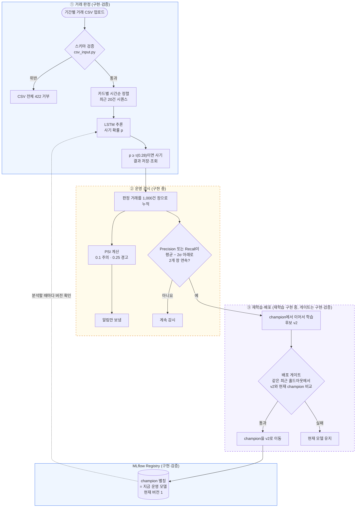

# 발표자 가이드

> 시스템을 직접 만들지 않은 팀원이 이 문서만 읽고 발표와 질의응답을 할 수 있도록 정리했습니다.
> 모든 숫자에는 출처 파일을 붙였습니다. 출처가 없는 숫자는 쓰지 않았습니다.
> 작성 기준: 2026-10-08, 커밋 `a1b5631`과 그 시점의 작업 중 파일.
> **「구현 중」 표시가 붙은 내용은 아직 검증되지 않았습니다. 발표에서 "완성했다"고 말하면 안 됩니다.**

## 목차

1. [한 문장 요약과 AIOps가 필요한 이유](#1-한-문장-요약과-aiops가-필요한-이유)
2. [전체 구조와 CSV 한 개의 여정](#2-전체-구조와-csv-한-개의-여정)
3. [구성 요소별 설명](#3-구성-요소별-설명)
4. [핵심 설계 결정과 근거](#4-핵심-설계-결정과-근거)
5. [검증한 것과 아직 안 된 것](#5-검증한-것과-아직-안-된-것)
6. [시연 대본 (구현 후 갱신)](#6-시연-대본-구현-후-갱신)
7. [예상 질문과 답](#7-예상-질문과-답)
8. [용어집](#8-용어집)
9. [발표에서 피해야 할 표현](#9-발표에서-피해야-할-표현)

---

## 1. 한 문장 요약과 AIOps가 필요한 이유

### 한 문장 요약

**카드 거래 CSV를 올리면 카드별 최근 20건의 흐름을 LSTM이 읽어 이상거래를 판정하고, 모델이 조용히 나빠지는 순간을 감지해 재학습한 새 모델이 기준을 통과할 때만 운영 모델을 바꾸는 시스템입니다.**

### 왜 AIOps가 필요한가: "서버는 멀쩡한데 모델은 틀린다"

일반 서버는 고장 나면 에러를 냅니다. 그래서 응답이 끊기면 바로 알 수 있습니다.
모델은 다릅니다. 입력이 바뀌거나 새 사기 수법이 나와도 서버는 200 응답을 계속 돌려줍니다. 숫자만 틀려질 뿐입니다.
그래서 사람이 따로 지켜보지 않으면 모델이 나빠진 것을 아무도 모릅니다.

이 문제는 실제로 이 프로젝트에서도 일어났습니다.

| 겪은 일 | 왜 위험했나 | 출처 |
|---|---|---|
| 가맹점 전월 매출의 음수 약 1,500건이 로그 변환에서 무한대가 되어, 검증 데이터에서 NaN이 471만 개 생겼습니다 | 에러 없이 학습이 진행될 수 있는 "조용한 실패"였습니다 | `docs/발표노트.md` 1절 |
| 서빙 쪽에서만 승인시간대를 문자열로 정렬해 "7"이 "15"보다 뒤에 놓였습니다 | 거래 순서가 뒤집혀도 서버는 정상 응답합니다 | `data/features.py` `sort_transactions()`, `docs/results/검증결과.md` |
| PSI가 해외·할부 비율이 1%에서 50%로 바뀌어도 0으로 나왔습니다 | 감시 장치 자체가 변화를 못 보는데도 "정상"으로 표시됩니다 | `docs/설계지표.md` 5-2절, `backend/tests/test_psi.py` |

`data/features.py` 맨 위 주석이 이 문제를 한 줄로 요약합니다. 학습과 서빙에서 입력을 만드는 방식이 조금이라도 다르면 서버는 정상 응답하면서 틀린 확률을 내놓습니다.

그래서 이 시스템은 세 가지를 합니다.

1. **들어오는 데이터를 막는다**: 잘못된 CSV는 모델에 닿기 전에 거부합니다.
2. **모델 성능을 지켜본다**: 분포 변화(PSI)와 실제 성능(Precision·Recall)을 지켜 봅니다.
3. **바꿀 때는 시험을 본다**: 재학습한 모델은 배포 게이트를 통과해야만 운영에 올라갑니다.

---

## 2. 전체 구조와 CSV 한 개의 여정

### 전체 구조

색이 칠해진 상자는 구현·검증한 부분이고, 점선 상자는 **구현 중**인 부분입니다.

### CSV 한 개의 여정 (쉬운 말로)

예시로 저장소에 들어 있는 가상 CSV `data/sample_card_transactions.csv`(카드 2장, 거래 50건)를 올린다고 생각하면 됩니다(`docs/FastAPI-CSV서버.md`).

| 단계 | 무슨 일이 일어나나 | 담당 파일 |
|---|---|---|
| 1. 업로드 | 사용자가 대시보드나 `POST /data/upload`로 CSV를 올립니다 | `routers/data.py` |
| 2. 입구 검사 | 필수 16개 컬럼, 날짜 형식, 코드값, 중복 거래를 검사합니다. 한 행이라도 틀리면 CSV 전체를 422로 돌려보내고, 처음 틀린 행 번호와 컬럼을 알려줍니다 | `data/csv_input.py` |
| 3. 보관 | 통과한 CSV를 저장하고 업로드 ID를 돌려줍니다. 모델이 없어도 저장은 됩니다 | `data/storage.py` |
| 4. 분석 요청 | `POST /predict/batch`에 업로드 ID와 (선택) 기간을 보냅니다 | `routers/predict.py` |
| 5. 운영 모델 확인 | 서버가 MLflow에서 `champion`이 가리키는 버전을 확인합니다. 바뀌었으면 새 버전을 불러오고, 불러오다 실패하면 기존 모델로 계속 판정합니다 | `model_loader.py` `get_model()` |
| 6. 줄 세우기 | 카드별로 날짜 → 시간대(숫자) → 승인SEQ 순으로 정렬합니다 | `data/features.py` `sort_transactions()` |
| 7. 판정 대상 고르기 | 같은 카드의 직전 거래가 19건 이상 있는 거래만 판정합니다. 모자라면 거부하지 않고 "제외"로 세어 결과에 표시합니다. 샘플 CSV는 50건 중 12건이 판정 대상, 38건이 이력 부족입니다 | `batch_service.py` `prepare_batch()` |
| 8. 숫자로 바꾸기 | 거래 한 건을 숫자 17개(금액, 시간대, 해외 여부, 가맹점 특성, 할부, 카드 종류 등)로 바꾸고, 학습 때 저장한 스케일러로 0~1 범위에 맞춥니다 | `data/features.py` `encode()`, `FraudScaler` |
| 9. 20건 묶기와 추론 | 판정 대상 거래마다 "자기 포함 최근 20건"을 묶어 LSTM에 넣습니다. 4,096개씩 나눠 추론합니다 | `batch_service.py` `analyze_batch()` |
| 10. 판정 | 사기 확률이 τ(0.28) 이상이면 사기로 표시합니다 | `batch_service.py` |
| 11. 성적 매기기 | CSV에 정답 컬럼(`이상거래여부`)이 있으면 정답이 있는 거래만으로 Precision·Recall·F2를 계산합니다 | `monitoring/metrics.py` `evaluate()` |
| 12. 결과 저장 | 거래별 결과 CSV와 요약 JSON을 저장합니다. 요약에는 모델 버전, τ, 판정·제외·경보 건수, 처리 시간이 들어갑니다 | `batch_service.py` |
| 13. 감시 기록 (**구현 중**) | 판정한 거래를 감시 기록에 이어 붙이고, 1,000건이 찰 때마다 창을 닫아 PSI와 Precision·Recall을 계산합니다 | `monitoring/drift_monitor.py` |
| 14. 재학습 요청 (**구현 중**) | 성능이 2개 창 연속으로 기준 아래면 응답을 돌려준 뒤 백그라운드에서 재학습을 시작합니다 | `routers/predict.py`, `retrain.py` |

핵심은 **CSV 한 행 = 모델 입력 하나가 아니라는 점**입니다. CSV는 외부 입력 단위이고, 20건 시퀀스는 서버가 내부에서 만드는 모델 입력 단위입니다(`docs/현황과-남은작업.md` 1절).

---

## 3. 구성 요소별 설명

파일 경로는 저장소 최상위 기준입니다. `serving_app/`은 `backend/serving_app/`입니다.

### 3-1. 데이터와 전처리

| 구성 요소 | 하는 일 | 왜 필요한가 | 파일 |
|---|---|---|---|
| 데이터 준비 스크립트 | 원본 CSV를 합쳐 시간 기준으로 학습·검증·운영 구간으로 나누고, 스케일러를 학습 기간으로 한 번만 fit해 저장합니다 | 제공된 Training/Validation이 같은 기간에서 무작위로 나뉘어 있어 그대로 쓰면 미래 정보가 학습에 섞이기 때문입니다 | `backend/scripts/prepare_data.py` |
| 공용 전처리 | 거래를 숫자 17개로 바꾸는 규칙과 정렬 규칙, 20건 묶기 규칙을 한 곳에 둡니다 | 학습과 서빙이 같은 함수를 써야 "조용히 틀리는" 일이 없기 때문입니다 | `data/features.py` |
| CSV 입구 검사 | 컬럼·값·코드·중복을 검사하고 위반 시 422로 거부합니다 | 잘못된 값이 전처리에서 0으로 덮이기 전에 막아야 하기 때문입니다 | `data/csv_input.py` |

**비유**: 공용 전처리는 "같은 자(ruler)"입니다. 학습 때 cm 자로 재고 서빙 때 inch 자로 재면 숫자는 나오지만 의미가 없습니다. 그래서 자를 하나만 만들어 양쪽이 같이 씁니다.

### 3-2. 모델

| 항목 | 내용 | 출처 |
|---|---|---|
| 구조 | LSTM 32 → LSTM 32 → LSTM 16 → Dense 16(relu) → Dense 1(sigmoid). LSTM 층 구성은 수업(HAIC) 스켈레톤을 유지했습니다 | `backend/serving_app/lstm_model.py` |
| 바꾼 것 | HAIC는 종가를 맞히는 회귀(mse)였고, 여기서는 사기 확률을 내야 하므로 sigmoid와 binary crossentropy로 바꿨습니다 | `lstm_model.py` 주석 |
| 입력 | 같은 카드의 최근 20건 × 피처 17개. 마지막 거래를 판정합니다 | `data/features.py` |
| 학습 | 2021~2023년 시퀀스 1,436,555개, 최대 15 epoch, 15 epoch까지 갔고 505초 걸렸습니다 | `docs/발표노트.md` 2절 |

**왜 LSTM인가**: 직전 거래가 이상거래였으면 이번 거래도 이상거래일 비율이 42.9%이고, 직전이 정상이면 2.2%입니다. 가장 많은 사기 유형(카드 위변조, 44.6%)은 정의 자체가 "최근 거래 패턴에 비해 금액 급증"이고, 실제 금액이 직전 10건 평균의 6.13배였습니다(`docs/데이터분석.md` 5절). 그래서 거래 한 건만 보는 모델보다 순서를 읽는 모델이 유리합니다.

### 3-3. 판정 기준점 τ

| 항목 | 내용 | 출처 |
|---|---|---|
| 역할 | 모델은 확률만 냅니다. 몇 % 이상을 사기로 볼지 정하는 합격선이 τ입니다 | `docs/설계지표.md` 3절 |
| 값 | 0.28 | `backend/serving_app/models/thresholds.json` |
| 정하는 법 | 2024년 상반기 데이터에서 τ를 0.01 간격으로 바꿔 가며 F2가 가장 높은 값을 고릅니다 | `monitoring/metrics.py` `best_threshold()` |
| 보관 | 모델 버전마다 τ가 다르므로 MLflow에 모델과 함께 저장합니다. 모델이 바뀌면 τ도 같이 바뀝니다 | `docs/4단계-MLflow와-배포게이트.md` |

### 3-4. MLflow Registry와 `champion`

| 구성 요소 | 하는 일 | 파일 |
|---|---|---|
| Registry | 모델을 버전 번호로 보관합니다. 모델 이름은 `CardFraudLSTM`입니다 | `serving_app/registry.py` |
| `champion` 별칭 | "지금 운영 중인 버전"을 가리키는 이름표입니다. 현재 버전 1(v1)을 가리킵니다 | `registry.py`, `docs/results/검증결과.md` |
| 묶음 보관 | 모델, 스케일러(`scaler.pkl`), τ·피처 순서·운영 기준(`settings.json`)을 같은 실행(run)에 묶어 둡니다 | `train_and_register.py`, `model_loader.py` |
| 로더 | `champion`이 가리키는 버전 번호를 먼저 고정한 뒤 그 버전의 세 구성품을 함께 불러옵니다. 다 불러온 뒤에만 캐시를 교체하므로, 실패하면 기존 모델이 그대로 남습니다 | `serving_app/model_loader.py` |

**비유**: `champion`은 "현재 근무 중" 명찰입니다. 새 직원(v2)이 들어와도 명찰을 옮겨 달기 전까지는 기존 직원(v1)이 일합니다. 서버는 분석을 시작할 때마다 명찰이 누구에게 있는지 확인하므로, 명찰만 옮기면 서버를 껐다 켜지 않아도 다음 분석부터 새 직원이 일합니다.

**왜 모델·스케일러·τ를 같이 묶나**: 새 모델에 옛 τ를 쓰거나, 옛 스케일러로 바꾼 숫자를 새 모델에 넣으면 또 "조용히 틀리는" 상황이 됩니다. 로더는 로딩 중에 별칭이 바뀌더라도 모델과 τ가 서로 다른 버전에서 오지 않도록 버전 번호를 먼저 고정합니다(`docs/4단계-MLflow와-배포게이트.md`).

### 3-5. 배포 게이트

| 항목 | 내용 | 파일 |
|---|---|---|
| 역할 | 재학습한 후보 v2를 운영에 올려도 되는지 판단합니다. **v1에는 쓰지 않았습니다** | `monitoring/deployment_gate.py` |
| 방식 | 후보와 현재 `champion`을 **같은 최근 홀드아웃**에서 각자 자기 τ로 채점합니다 | `deployment_gate.py` `check_gate()` |
| 통과 조건 | 아래 표의 조건을 **모두** 만족해야 합니다 | 같은 파일 |
| 통과 시 | `champion`을 v2로 옮깁니다 | `train_and_register.py` `register_candidate()` |
| 실패 시 | 후보도 Registry에 버전으로 남지만 `gate_passed=false` 태그가 붙고, `champion`은 그대로입니다 | `train_and_register.py`, `backend/tests/test_registry_integration.py` |

| 게이트 조건 | 기준 | 출처 |
|---|---|---|
| 평가 표본 | 1,000건 이상, 실제 이상거래 20건 이상, 정상 거래 존재 | `deployment_gate.py` `MIN_SAMPLES`, `MIN_FRAUDS` |
| 성능 회귀 없음 | F2(v2) ≥ F2(현재 champion) | `deployment_gate.py` |
| Recall 하한 | 0.95 이상 | `thresholds.json` `gate.r_min` |
| 경보 비율 상한 | 6% 이하 (탐지팀 처리량 가정) | `thresholds.json` `gate.alert_cap` |
| 입력 점수 | 0~1의 유한한 값, 정답과 같은 길이. NaN·무한대는 거부 | `deployment_gate.py` `validate_predictions()` |

추가 안전장치가 두 개 있습니다(`train_and_register.py`).

- 후보와 운영 모델의 스케일러가 다르면 비교 자체를 거부합니다.
- 평가하는 사이에 `champion`이 다른 버전으로 바뀌었으면 교체하지 않고 오류를 냅니다.

**비유**: 배포 게이트는 "승진 심사"입니다. 지금 일하는 사람과 후보에게 **같은 시험지**를 주고, 후보가 현직자보다 못하지 않고(F2), 사기를 95% 이상 잡고(Recall), 탐지팀이 감당 못 할 만큼 경보를 울리지 않을 때(6%)만 자리를 바꿉니다.

### 3-6. CSV 서버와 대시보드

| 구성 요소 | 하는 일 | 파일 |
|---|---|---|
| FastAPI 앱 | 라우터 조립, CORS, 시작 시 로딩 방식(Lazy/Eager) | `serving_app/main.py` |
| 주요 API | `/data/upload`, `/predict/batch`, `/predict/results/...`, `/health`, `/metrics/summary`, `/logs` | `serving_app/routers/` |
| 대시보드 | 서버 루트(`/`)에서 제공. Dashboard·Analysis·Datasets·System 탭 | `frontend/index.html`, `frontend/README.md` |
| 요청 로그·지표 | 요청 수, 평균 응답시간, 5xx 비율 | `monitoring/logger.py`, `routers/metrics.py` |
| Docker | 기본 `api` 이미지(모델 없이 업로드·조회만, 분석은 503)와 실제 판정용 `model-runtime` 이미지 | `serving_app/Dockerfile`, `docker-compose.yml` |
| 환경변수 `MODEL_SOURCE` | 기본값 `mlflow`(champion 사용). `local`은 등록 전 v1 파일을 직접 읽을 때만 씁니다 | `serving_app/config.py` |

### 3-7. 운영 감시 (**구현 중**)

> 아래는 개발자가 지금 작성 중인 `backend/serving_app/monitoring/drift_monitor.py`의 설계입니다. 아직 커밋·검증되지 않았습니다.

| 항목 | 설계 | 출처 |
|---|---|---|
| 창 | 판정한 거래를 시간순으로 이어 붙이고 1,000건마다 창 하나를 닫습니다 | `docs/설계지표.md` 5-3절, `thresholds.json` `trigger.window_size` |
| PSI | 창마다 승인 금액, 승인 시간대, 해외 여부, 가맹점 매출 구간, 할부 여부, 사기 확률의 PSI를 계산합니다. 하나라도 0.1 이상이면 주의, 0.25 이상이면 경고 **알림만** 보냅니다 | `docs/설계지표.md` 5-2절 |
| 판정 보류 | 창 안의 경보가 30건 미만이면 Precision을, 실제 사기가 20건 미만이면 Recall을 판정하지 않습니다. 보류된 창은 연속 횟수를 늘리지도 초기화하지도 않습니다 | `thresholds.json` `trigger.min_alerts`, `min_frauds`, `drift_monitor.py` |
| 재학습 요청 | Precision 또는 Recall이 평균 − 2σ 아래로 2개 창 연속이면 재학습을 요청합니다 | `docs/설계지표.md` 5-3절 |
| 모델 교체 후 | `champion`이 바뀌면 판정 창을 처음부터 다시 셉니다. 재학습 전 예측이 창에 남아 있으면 바로 다시 드리프트로 판정되기 때문입니다 | `docs/설계지표.md` 6절 |
| 조회 | `GET /monitoring/status`로 창 기록과 이벤트를 봅니다 | `serving_app/routers/monitoring.py` (구현 중) |

**비유**: PSI는 "손님 구성이 달라졌다"는 체온계이고, Precision·Recall은 "실제로 오진이 늘었다"는 진단 결과입니다. 체온이 조금 올랐다고 바로 수술(재학습)하지 않고, 진단 결과가 두 번 연속 나쁠 때만 수술합니다.

### 3-8. 재학습 (**구현 중**)

> 아래는 개발자가 지금 작성 중인 `backend/serving_app/retrain.py`의 설계입니다. 아직 커밋·검증되지 않았습니다. 숫자가 바뀔 수 있습니다.

| 항목 | 설계 (작성 중 코드 기준) |
|---|---|
| 시작점 | 처음부터 학습하지 않고 현재 `champion`의 가중치에서 이어서 학습(fine-tune)합니다 |
| 데이터 | 현재 champion이 판정한 거래 중 정답이 있는 최근 40,000건 |
| 나누기 | 시간순으로 앞 60%는 fine-tune, 다음 20%는 τ 선택, 마지막 20%는 게이트 홀드아웃. 40,000건이 다 차면 홀드아웃은 약 8,000건입니다 |
| 왜 40,000건인가 | 범위를 더 넓히면 앞쪽 60%가 드리프트 이전 데이터로 채워져 후보가 새 패턴을 배우지 못합니다(`docs/설계지표.md` 6절) |
| 데이터가 모자라면 | 홀드아웃이 1,000건 또는 이상거래 20건에 못 미치면 게이트가 후보를 거부하고 현재 모델이 유지됩니다(`deployment_gate.py`) |
| 학습 설정 | 3 epoch, 학습률 1e-3, 배치 512, seed 42. 홀드아웃은 설정을 고르는 데 쓰지 않습니다 |
| 기준 승계 `[가정]` | 후보는 현재 운영 모델의 트리거 기준(평균 − 2σ), PSI 기준 분포, 게이트 기준을 그대로 이어받습니다. 기준은 2024년 상반기에 잰 "정상 운영"의 모습이고, 게이트 기준을 결과를 본 뒤 느슨하게 바꾸지 못하게 고정하기 위해서입니다. 한계: v2의 정상 흔들림이 v1과 다르면 기준이 v2에 맞지 않을 수 있습니다(`docs/설계지표.md` 6절) |
| 스케일러 | 학습 때 저장한 `scaler.pkl`을 그대로 씁니다 |
| 실행 위치 | 분석 응답을 먼저 돌려준 뒤 FastAPI BackgroundTasks에서 실행합니다. 한 번에 하나만 돌립니다 |
| 결과 | `register_candidate()`로 게이트에 올립니다. 통과하면 champion이 v2로 옮겨지고 서버가 새 모델을 불러옵니다. 실패하면 현재 모델을 유지하고 연속 횟수를 비웁니다 |

---

## 4. 핵심 설계 결정과 근거

### 4-1. 정확도 대신 Precision·Recall

| 근거 | 출처 |
|---|---|
| 이상거래 비율이 약 3.7%라서 모든 거래를 정상으로 찍어도 정확도 96.3%가 나옵니다. 사기를 한 건도 못 잡는 모델이 높은 점수를 받으므로 정확도는 어떤 판단에도 쓰지 않습니다 | `docs/설계지표.md` 1절 |
| 전체 1,952,871건 중 이상거래 72,008건, 3.69% | `docs/데이터분석.md` 1절 |

### 4-2. F2 (β = 2)

F-beta의 β는 "Recall을 Precision보다 몇 배 중요하게 볼지"입니다. 사기를 놓친 손해가 정상 고객을 잘못 막은 손해보다 크기 때문에 Recall 쪽에 무게를 둡니다.

| 근거 | 값 | 출처 |
|---|---|---|
| 사기 1건 평균 승인 금액 | 1,040,459원 | `thresholds.json` `amount.fraud_mean`, `docs/설계지표.md` 4-1절 |
| 정상 거래 평균 승인 금액 | 24,893원 (약 42배 차이) | 같은 곳 |
| β 1 → 2 | 정상 고객 2.3명을 더 확인하는 대가로 사기 1건을 더 잡습니다 | `docs/설계지표.md` 4-1절 (`backend/scripts/compare_beta.py`) |
| β 2 → 3 → 4 → 5 | 대가가 6.5명 → 13.0명 → 20.4명으로 빠르게 커집니다 | 같은 곳 |
| 경보 여유 | β=2의 경보 비율 4.45%는 상한 6%까지 1.55%p 여유. β=3은 0.85%p, β=4는 0.44%p, β=5는 6.11%로 상한 초과 | 같은 곳 |

β 비교 전체 표(2024년 상반기 235,562건, 실제 사기 8,475건, `docs/설계지표.md` 4-1절):

| β | τ | Recall | Precision | 경보 비율 | 놓친 사기 | 잘못 막은 정상 |
|---|---|---|---|---|---|---|
| 1 | 0.49 | 0.898 | 0.849 | 3.81% | 862 | 1,357 |
| **2** | **0.28** | **0.952** | **0.770** | **4.45%** | **408** | **2,409** |
| 3 | 0.16 | 0.978 | 0.683 | 5.15% | 188 | 3,849 |
| 4 | 0.11 | 0.986 | 0.638 | 5.56% | 120 | 4,732 |
| 5 | 0.06 | 0.993 | 0.585 | 6.11% | 59 | 5,979 |

**주의**: β는 "점수가 가장 높은 β"로 고를 수 없습니다. β마다 자기 기준에서는 항상 최고점이 나오기 때문입니다. 그래서 얻는 것(더 잡은 사기)과 잃는 것(더 막은 정상 고객)을 비교해 정했습니다.

### 4-3. τ = 0.28과 v1 성능

v1을 학습에 쓰지 않은 2024년 상반기에 돌린 결과입니다(`thresholds.json` `valid`, `docs/설계지표.md` 8절).

| 지표 | 값 |
|---|---|
| τ (F2 최대) | 0.28 |
| F2 | 0.9089 |
| Recall | 0.9519 |
| Precision | 0.7700 |
| PR-AUC | 0.9419 (아무것도 학습하지 않은 기준선 0.0360) |
| 경보 비율 | 4.45% |

### 4-4. 배포 게이트 수치

| 기준 | 값 | 근거 | 출처 |
|---|---|---|---|
| Recall 하한 | 0.95 | v1 Recall 0.9519를 소수 둘째 자리에서 내린 값입니다. 출시 때보다 사기를 더 놓치는 모델은 내보내지 않습니다 | `docs/설계지표.md` 4-2절, `thresholds.json` |
| 경보 비율 상한 | 6% | 탐지팀 처리량에 대한 **가정**입니다. 실제 인력으로 확인한 숫자가 아닙니다 | `docs/설계지표.md` 4-2절, `backend/README.md` |
| F2 회귀 없음 | F2(v2) ≥ F2(현재) | 같은 데이터로 비교하므로 이상거래 비율 차이가 결과에 끼어들지 않습니다 | `docs/설계지표.md` 4-2절 |
| 최소 표본 | 1,000건, 사기 20건 | HAIC 스켈레톤처럼 41행을 8:2로 나누면 검증 샘플이 5개뿐이라 결과가 우연에 좌우됩니다 | `docs/설계지표.md` 4-3절 |

예전에는 경보량을 Precision 하한(P_min 0.5696)으로 간접 제한했습니다. 그런데 실제 Recall이 0.95보다 높으면 P_min을 통과하고도 경보가 6%를 넘을 수 있었습니다. β=5의 경보 비율 6.11%가 그 사례입니다. 그래서 경보 비율을 직접 검사하고 P_min은 참고값으로만 남겼습니다(`docs/설계지표.md` 4-2절).

### 4-5. 드리프트 트리거: 평균 − 2σ, 2개 창 연속

| 결정 | 근거 | 출처 |
|---|---|---|
| 창 크기 1,000건 | HAIC처럼 21건씩 보면 사기율 3.7%에서 창에 사기가 평균 1건도 안 들어가 Recall을 계산할 수 없습니다. 1,000건이면 평균 37건 정도 들어갑니다 | `docs/설계지표.md` 5-3절 |
| 고정 비율 대신 −2σ | 모델이 멀쩡해도 창마다 점수가 흔들립니다. 정상 창 Precision의 표준편차가 0.0702였으므로 "20% 하락" 같은 고정 기준은 정상적인 흔들림에도 울립니다 | `docs/설계지표.md` 5-3절, `thresholds.json` |
| Precision 기준 | 0.6290 (정상 창 224개 평균 0.7694 − 2 × 0.0702) | `thresholds.json` `trigger.precision` |
| Recall 기준 | 0.8632 (정상 창 232개 평균 0.9506 − 2 × 0.0437) | `thresholds.json` `trigger.recall` |
| 2개 창 연속 | 2024년 상반기 정상 데이터 1,000건 창 235개에서 기준 아래로 떨어진 창이 13개 있었지만 연속으로 떨어진 적은 없었습니다. 한 번 튄 값으로 재학습하면 비용만 듭니다 | `docs/설계지표.md` 5-4절 |
| −1σ를 버린 이유 | 같은 정상 기간에 −1σ는 기준 미달 창 58개, 잘못된 재학습 15회. −2σ는 13개, 0회 | `docs/설계지표.md` 5-4절 |

정상 창 개수가 235개인데 Precision은 224개, Recall은 232개인 이유는 판정 보류 때문입니다. 경보가 30건 미만인 창은 Precision을, 사기가 20건 미만인 창은 Recall을 계산하지 않았습니다(`backend/scripts/measure_v1.py` `window_stats()`).

**Precision과 Recall을 둘 다 보는 이유**: 모델이 신종 사기를 알아보지 못하면 그 거래는 사기로 표시되지 않습니다. 표시되지 않은 거래는 Precision 계산에 들어가지 않으므로 신종 사기는 Recall에서만 드러납니다. 반대로 정상 고객의 패턴이 바뀌어 오탐이 늘면 Precision에서 드러납니다(`docs/설계지표.md` 5-3절).

### 4-6. PSI는 알림만

| 근거 | 출처 |
|---|---|
| 거래 모양이 바뀌었다고 모델 성능이 반드시 떨어지지는 않습니다. 명절처럼 소비만 늘어난 경우가 그렇습니다 | `docs/설계지표.md` 5-1절 |
| 원래는 PSI 경고 중에 트리거를 −1σ로 좁히려 했습니다. 그런데 −1σ는 정상 기간에도 재학습을 15번 일으켰으므로, 거래 모양만 바뀐 상황에서 기준을 좁히면 성능이 그대로여도 재학습이 돌 가능성이 높습니다. 그래서 이 규칙을 뺐습니다 | `docs/설계지표.md` 5-4절 |
| PSI와 성능 지표는 단위가 달라 가중합으로 섞기 어렵고, 가중치를 맞출 실제 드리프트 사례도 없습니다 | `docs/설계지표.md` 5-4절 |
| 0.1과 0.25는 신용평가 분야의 관례값입니다 | `docs/설계지표.md` 5-2절 |
| 정상 창의 PSI 최댓값은 0.079(승인 시간대)로 주의 기준 0.1 미만이었습니다 | `thresholds.json` `psi.normal_window_max` |

상황별로 정리하면 다음과 같습니다(`docs/설계지표.md` 5-4절).

| 상황 | PSI | Precision | Recall | 결과 |
|---|---|---|---|---|
| 평상시 | 정상 | 정상 | 정상 | 없음 |
| 명절 소비 증가 | 상승 | 정상 | 정상 | 알림만 |
| 정상 고객 패턴 변화로 오탐 증가 | 상승 | 하락 | 정상 | 재학습 |
| 신종 사기 등장 | 상승 | 정상 | 하락 | 재학습 |

교수님이 수업에서 "추석처럼 물량이 커지면 RMSE만으로는 드리프트로 잘못 판단한다"는 문제를 제기했습니다. 이 설계는 거래 모양만 바뀌고 성능은 그대로면 재학습하지 않으므로 같은 문제를 피합니다(`docs/설계지표.md` 5-4절).

### 4-7. 시간순 분할

| 기간 (데이터에 기록된 거래 시점) | 용도 | 시퀀스 수 | 출처 |
|---|---|---|---|
| 2021~2023 | v1 학습, 스케일러 fit | 1,436,555 | `docs/발표노트.md` 1절 |
| 2024년 상반기 | τ 선택, β 비교, 감시 기준 측정 | 235,562 | 같은 곳 |
| 2024년 하반기 | 운영 시연. 재학습 시 fine-tune 구간과 게이트 홀드아웃을 이 안에서 시간순으로 나눔 | 231,897 | 같은 곳, `docs/설계지표.md` 4-3절 |

**이유**: AI Hub가 제공한 Training/Validation은 같은 2021~2024 기간에서 무작위로 나뉘어 있었고, Validation 카드 2,577장이 모두 Training에도 있었습니다(`docs/데이터분석.md` 2절). 그대로 쓰면 모델이 미래 거래를 보고 학습하게 됩니다. 그래서 두 파일을 합친 뒤 시간 기준으로 다시 나눴습니다. 이 기간 구분은 성능을 확인하기 전에 고정했습니다(`docs/설계지표.md` 4-3절).

### 4-8. τ 선택 데이터와 게이트 시험지 분리

τ를 고른 데이터로 다시 합격 여부를 판단하면 점수가 낙관적으로 나옵니다(`docs/설계지표.md` 4-3절). 모의고사 문제를 보고 커트라인을 정한 뒤 같은 문제로 합격을 판정하는 셈입니다. 그래서 게이트는 τ를 다시 고르지 않고, 각 모델이 이미 가진 τ로 채점합니다(`docs/4단계-MLflow와-배포게이트.md`). 재학습 코드(구현 중)도 fine-tune 60%, τ 선택 20%, 홀드아웃 20%를 겹치지 않게 나눕니다(`backend/serving_app/retrain.py`).

홀드아웃을 **최근** 구간에서 뽑는 이유는, 과거 데이터로만 평가하면 새 패턴에 적응한 v2의 장점이 드러나지 않기 때문입니다(`docs/설계지표.md` 4-3절).

### 4-9. 고정 스케일러

스케일러를 다시 fit하면 같은 금액이 다른 숫자로 들어가 기존 가중치와 어긋납니다(`docs/설계지표.md` 6절, `data/features.py` `FraudScaler` 주석). 그래서 학습 기간으로 한 번만 fit해 저장하고, 서빙과 재학습 모두 그 파일을 그대로 씁니다. 게이트는 후보와 운영 모델의 스케일러가 다르면 비교를 거부합니다(`train_and_register.py`).

### 4-10. `champion` 별칭과 v1 등록 방식

| 결정 | 근거 | 출처 |
|---|---|---|
| Production 단계 대신 `champion` 별칭 | 설치된 MLflow 3.16이 지원하는 별칭 API로 수업의 Production 단계와 같은 역할을 구현했습니다 | `docs/4단계-MLflow와-배포게이트.md` |
| v1은 게이트 없이 등록 | 게이트는 "현재 운영 모델과 비교"하는 장치인데, v1 이전에는 비교할 운영 모델이 없습니다. v1이 운영을 시작하는 기준 모델입니다 | `docs/설계지표.md` 4-2절 |
| 기준 등록은 한 번만 | `register_baseline()`은 champion이 이미 있으면 거부합니다. 그 뒤의 모든 새 모델은 `register_candidate()`로 게이트를 거쳐야 합니다 | `train_and_register.py`, `docs/4단계-MLflow와-배포게이트.md` |

---

## 5. 검증한 것과 아직 안 된 것

### 5-1. 검증한 것 (숫자 근거 있음)

| 검증 내용 | 결과 | 출처 |
|---|---|---|
| **학습·서빙 전처리 일치** | 원본 CSV 32개를 서버와 같은 경로(`parse_csv` → 정렬 → `encode` → 저장된 스케일러 → 20건 묶기)로 변환해 학습 입력과 비교했습니다. 거래 1,952,871건, 시퀀스 1,281,085개에서 최대 차이 0. 분기 파일 32개를 업로드처럼 파일마다 따로 변환해 파일별로 카드의 첫 19건이 빠지므로, 전체를 합친 시퀀스 수 1,904,014개보다 적습니다 | `docs/results/검증결과.md` |
| 위 비교에서 찾아 고친 버그 2개 | ① 승인시간대를 문자열로 정렬해 "7"이 "15"보다 뒤에 놓이던 문제 ② 업로드 검사가 카드 한도 빈칸을 거부하던 문제 | `docs/results/검증결과.md`, `data/features.py` |
| **MLflow에서 다시 불러온 모델 = 로컬 v1** | 2024년 상반기 검증 시퀀스 20,000건에서 점수 최대 차이 0, 판정 전건 일치 | `docs/results/검증결과.md` |
| **로컬 vs Docker 컨테이너 일치** | 운영 구간 카드 300장 CSV, 판정 43,503건에서 점수 최대 차이 0, 판정 전건 일치. 로컬과 컨테이너는 같은 라이브러리 버전(pandas 3.0.6, numpy 2.4.4, fastapi 0.141.1)을 씁니다 | `docs/FastAPI-CSV서버.md` 검증 절 |
| Docker 폴더 구조 변경 후 복구 | `api` 이미지 healthy·업로드 201·분석 503, `model-runtime` 이미지는 컨테이너에서 v1 등록 후 champion 버전 1로 분석, 재시작 후 업로드 기록과 운영 버전 유지 | `docs/FastAPI-CSV서버.md` |
| **서버가 기본으로 champion을 읽음** | `MODEL_SOURCE` 기본값을 `mlflow`로 바꿨습니다. 이전에는 기본값이 `local`이라 후보가 champion이 돼도 서버는 v1 파일을 계속 읽었습니다 | 커밋 `5980e19`, `serving_app/config.py` |
| **게이트 통과 시 재시작 없이 교체** | 합성 시험용 모델과 임시 DB로 확인: 실패 후보(버전 2)는 champion을 못 바꾸고 `gate_passed=false`로 남음, 합격 후보(버전 3)로 champion이 옮겨지면 다음 `get_model()`이 버전 3과 새 τ를 씀, 재로딩 실패 시 기존 모델 유지 | `backend/tests/test_registry_integration.py` |
| **PSI 범주형 버그 수정** | 이전에는 해외·할부처럼 0이 대부분인 피처가 분위수 구간 하나로 뭉개져 1% → 50% 변화에도 PSI가 0이었습니다. 범주형 3개(해외, 가맹점 매출 구간, 할부)는 값별 비율로 계산하도록 고치고 기준 분포를 다시 쟀습니다. τ와 게이트·트리거 기준은 재측정 후에도 같습니다 | 커밋 `a1b5631`, `monitoring/metrics.py`, `backend/tests/test_psi.py` |
| 재측정 후 정상 창 PSI 최댓값 | 금액 0.065, 시간대 0.079, 해외 0.016, 가맹점 매출 구간 0.036, 할부 0.018, 사기 확률 0.036 (모두 0.1 미만) | `thresholds.json` `psi.normal_window_max` |
| v1 측정값 재현 | τ, 검증 성능, 트리거 기준, 정상 기간 잘못된 재학습 횟수, β 비교표를 2026-10-08에 다시 계산해 일치 확인 | `docs/설계지표.md` 10절 |
| 자동 테스트 | 28개 통과(CSV/API 15, 배포 게이트 9, PSI 3, Registry 흐름 1). 커밋 `a1b5631` 이후 실행 | `docs/results/검증결과.md` |

### 5-2. 검증의 한계 (발표에서 먼저 밝힐 것)

- **Registry 교체 테스트는 합성 시험용 모델로 했습니다.** 제어 흐름이 맞다는 증거이지, 실제 재학습한 v2의 성능을 보여주는 결과가 아닙니다(`docs/results/검증결과.md`).
- **데이터에는 자연스러운 신종 사기 드리프트가 없습니다.** 4년간 사기 유형 구성이 거의 같았습니다(유형 03이 43~46%). 그래서 시연의 드리프트는 주입한 시뮬레이션입니다(`docs/데이터분석.md` 6절).
- **정답이 즉시 들어온다고 가정합니다.** 시연은 CSV에 정답을 함께 넣습니다. 실제 운영에서는 정답이 늦게 확정됩니다(`docs/설계지표.md` 5-1절).
- **사기 확률 PSI의 기준 분포는 2024년 상반기 점수입니다.** 정상 창도 같은 기간이라 정상 창 PSI 최댓값 0.036은 실제보다 낮게 나왔을 수 있습니다(`docs/설계지표.md` 5-2절, `backend/scripts/measure_v1.py`).
- **경보 상한 6%는 가정입니다**(`backend/README.md`).
- 카드 한도 0이 운영 구간의 약 20%입니다. 이를 결측으로 따로 표시하는 개선은 피처를 바꾸는 일이라 재학습이 필요해 남겨 두었습니다(`docs/설계지표.md` 2절).

### 5-3. 아직 안 된 것

| 항목 | 상태 | 비고 |
|---|---|---|
| 1,000건 창 감시, PSI 알림, 연속 카운터, 재학습 요청 | **구현 중** (`drift_monitor.py`, 커밋 전) | 개발자가 검증 후 갱신 예정 |
| champion에서 fine-tune해 v2 생성 → 게이트 연결 | **구현 중** (`retrain.py`, 커밋 전) | 게이트 자체는 구현·검증 완료 |
| 분석 API에서 감시·재학습 호출, `/monitoring/status` | **구현 중** (`routers/predict.py`, `routers/monitoring.py` 수정 중) | |
| 실제 v2 생성과 champion 교체 | 실행한 적 없음 | 현재 champion은 버전 1 |
| 시연 시나리오 ①②③ | **구현 중** | 6절 참고 |
| 롤백 (승격 직후 다시 트리거되면 이전 버전으로) | 미구현 | `docs/설계지표.md` 6절 설계만 있음 |
| 대시보드의 감시·재학습 단계 | 화면에 「미연결」로 표시 | `frontend/README.md` |

---

## 6. 시연 대본 (구현 후 갱신)

> **이 절은 구현 후 갱신합니다.** 아래는 설계 문서(`docs/설계지표.md` 7절)에 적힌 기대 결과이며, 실제 실행 결과가 아닙니다. 실행 후 숫자와 화면을 채워 넣습니다.
> ②와 ③은 시뮬레이션 데이터이며, 발표에서 그렇게 밝힙니다.

### 시연 전 준비 (구현 후 갱신)

- [ ] 서버 실행 명령과 주소: `구현 후 갱신`
- [ ] 시나리오별 CSV 파일 이름과 위치: `구현 후 갱신`
- [ ] 시작 상태 확인: `/health`에서 champion 버전 1, τ 0.28
- [ ] MLflow 화면 주소: `구현 후 갱신`

### 시나리오 ① 정상

| 항목 | 내용 |
|---|---|
| 넣는 데이터 | 학습 기간과 같은 분포의 거래 (`구현 후 갱신`: 파일 이름, 건수) |
| 기대 결과 | PSI 알림 없음, 재학습 없음 |
| 실제 결과 | `구현 후 갱신`: 닫힌 창 수, 창별 Precision·Recall, PSI 최댓값 |
| 말할 것 | "평소에는 아무 일도 일어나지 않는 것이 정상입니다. 정상 6개월 데이터에서도 잘못된 재학습은 0회였습니다(`docs/설계지표.md` 5-4절)." |

### 시나리오 ② 명절

| 항목 | 내용 |
|---|---|
| 넣는 데이터 | 승인 금액과 건수를 늘린 정상 거래 (`구현 후 갱신`) |
| 기대 결과 | PSI 주의 또는 경고 알림, **재학습 없음** |
| 실제 결과 | `구현 후 갱신`: PSI 최댓값과 피처, 창별 Precision·Recall |
| 말할 것 | "거래 모양은 바뀌었지만 성능은 그대로이므로 알림만 보냅니다. 교수님이 말한 추석 RMSE 문제를 이렇게 피했습니다." |

### 시나리오 ③ 신종 사기

| 항목 | 내용 |
|---|---|
| 넣는 데이터 | 해외 소액 결제가 짧은 간격으로 이어지는 사기 패턴 (`구현 후 갱신`). 해외 거래는 전체의 0.8%이고 해외 이상거래 비율은 1.85%로 국내보다 낮아, 학습 데이터에 없던 패턴이라는 설명이 자연스럽습니다(`docs/데이터분석.md` 7절) |
| 기대 결과 | Recall이 기준 0.8632 아래로 2개 창 연속 → 재학습 → 게이트 통과 시 champion이 v2로 이동 |
| 실제 결과 | `구현 후 갱신`: 창별 Recall, 재학습 시작·종료 이벤트, 게이트 표(후보 vs 현재 F2·Recall·경보 비율), v2 버전 번호와 τ |
| 말할 것 | "Precision은 그대로인데 Recall만 떨어집니다. 모델이 모르는 사기는 애초에 경보가 안 울려서 Precision 계산에 들어가지 않기 때문입니다." |
| 게이트 실패 시 | `구현 후 갱신`. 실패해도 서비스는 멈추지 않고 기존 모델이 계속 판정합니다. 어떤 조건에서 떨어졌는지 보여줍니다 |

설계 문서는 ③에서 Recall이 기준 아래로 떨어지지 않으면 주입 패턴을 더 강하게 바꾼다고 적고 있습니다(`docs/설계지표.md` 7절).

---

## 7. 예상 질문과 답

### 지표와 기준

**Q1. 왜 정확도를 안 쓰나요?**
이상거래가 약 3.7%라서 전부 정상으로 찍어도 정확도가 96.3%입니다. 사기를 하나도 못 잡는 모델이 높은 점수를 받으므로 정확도는 판단에 쓰지 않습니다. 대신 사기를 얼마나 잡았는지(Recall)와 경보가 얼마나 맞았는지(Precision)를 봅니다(`docs/설계지표.md` 1절).

**Q2. 왜 F1이 아니라 F2인가요?**
사기 1건의 평균 금액이 1,040,459원으로 정상 거래 평균 24,893원의 약 42배입니다. 놓친 사기의 손해가 더 크므로 Recall에 무게를 둡니다. β를 1에서 2로 올리면 정상 고객 2.3명을 더 확인하는 대가로 사기 1건을 더 잡습니다. 3 이상은 대가가 6.5명, 13명, 20명으로 커지고 경보 상한 여유도 줄어서 2에서 멈췄습니다(`docs/설계지표.md` 4-1절).

**Q3. τ 0.28은 어떻게 정했나요?**
2024년 상반기 데이터에서 τ를 0.01 간격으로 바꿔 가며 F2가 가장 높은 값을 골랐습니다. 이 기간은 학습에 쓰지 않았습니다(`monitoring/metrics.py` `best_threshold()`, `thresholds.json`).

**Q4. Recall 하한 0.95와 경보 상한 6%의 근거는요?**
0.95는 v1의 실제 Recall 0.9519를 내린 값으로, "출시 때보다 사기를 더 놓치는 모델은 안 낸다"는 뜻입니다. 6%는 탐지팀 처리량에 대한 가정이며, 실제 인력으로 확인한 수치가 아니라고 문서에 밝혀 두었습니다(`docs/설계지표.md` 4-2절, `backend/README.md`).

### 감시와 재학습

**Q5. PSI만으로 재학습하지 않는 이유는?**
거래 모양이 바뀌어도 성능은 그대로일 수 있습니다. 명절이 대표적입니다. PSI 경고 때 기준을 −1σ로 좁히는 규칙을 시험했더니 정상 기간에도 잘못된 재학습이 15회 생겨서 뺐습니다. PSI는 정답 없이 빨리 볼 수 있는 조기 경보로만 쓰고, 재학습은 정답으로 계산한 성능이 결정합니다(`docs/설계지표.md` 5-1, 5-4절).

**Q6. 왜 −2σ이고, 왜 2개 창 연속인가요?**
모델이 멀쩡해도 창마다 Precision이 표준편차 0.07 정도 흔들립니다. 그래서 고정 비율 대신 정상 창의 평균과 표준편차로 기준을 정했습니다. 정상 6개월(창 235개)에서 −2σ 아래로 떨어진 창이 13개 있었지만 연속으로 떨어진 적은 없어서, 2개 창 연속 조건으로 잘못된 재학습이 0회였습니다. −1σ는 15회였습니다(`docs/설계지표.md` 5-3, 5-4절).

**Q7. 판정 창을 왜 1,000건으로 했나요?**
HAIC 실습처럼 21건씩 보면 사기율 3.7%에서 창에 사기가 평균 1건도 안 들어가 Recall을 계산할 수 없습니다. 1,000건이면 평균 37건 정도 들어갑니다. 그래도 사기가 20건 미만이거나 경보가 30건 미만인 창은 판정을 보류합니다(`docs/설계지표.md` 5-3절).

**Q8. 정답 지연은 어떻게 하나요?**
솔직히 이번 시연은 CSV에 정답을 함께 넣어 정답이 즉시 들어온다고 가정합니다. 실제 운영에서는 고객 신고나 탐지팀 확인을 거쳐 정답이 늦게 확정됩니다. 그래서 설계를 두 단계로 나눴습니다. 정답 없이 볼 수 있는 PSI가 먼저 알림을 보내고, 정답이 쌓이면 Precision·Recall로 재학습을 결정합니다. Precision은 탐지팀이 의심 거래를 바로 확인하므로 정답이 비교적 빨리 쌓입니다. 정답이 빈 거래는 판정만 하고 성능 집계에서는 빠집니다(`docs/설계지표.md` 5-1, 5-3절, `batch_service.py`).

**Q9. 재학습은 처음부터 하나요?** (구현 중임을 먼저 밝힐 것)
아니요. 현재 운영 모델의 가중치에서 이어서 학습(fine-tune)하도록 만드는 중입니다. 처음부터 학습하면 시간이 오래 걸리고, 최근 데이터만으로는 사기 수가 부족하기 때문입니다. 스케일러는 다시 맞추지 않습니다(`docs/설계지표.md` 6절, `retrain.py` 작성 중).

### 배포 게이트와 Registry

**Q10. v1은 왜 게이트 없이 올렸나요?**
게이트는 "후보가 지금 운영 모델보다 못하지 않은가"를 보는 장치입니다. v1 전에는 비교할 운영 모델이 없었습니다. 그래서 v1을 기준 모델로 champion에 등록했고, 이 등록 함수는 champion이 이미 있으면 거부합니다. 이후의 모든 모델은 게이트를 거쳐야 합니다(`docs/설계지표.md` 4-2절, `train_and_register.py`).

**Q11. τ를 고른 데이터와 게이트 시험지를 왜 분리하나요?**
τ를 고른 데이터로 다시 합격을 판정하면 그 데이터에 맞춰진 기준이라 점수가 낙관적으로 나옵니다. 모의고사 문제로 커트라인을 정하고 같은 문제로 합격을 판정하는 것과 같습니다. 그래서 게이트는 τ를 다시 고르지 않고, 홀드아웃은 fine-tune과 τ 선택에 쓰지 않은 최근 구간에서 뗍니다(`docs/설계지표.md` 4-3절).

**Q12. 게이트에서 떨어지면 서비스가 멈추나요?**
아니요. 현재 champion이 계속 판정합니다. 떨어진 후보도 Registry에 버전으로 남고 `gate_passed=false` 태그가 붙어서 왜 떨어졌는지 나중에 볼 수 있습니다. 합성 모델 테스트에서 실패 후보(버전 2)가 champion(버전 1)을 바꾸지 못하는 것을 확인했습니다(`backend/tests/test_registry_integration.py`).

**Q13. 모델이 바뀌면 서버를 재시작해야 하나요?**
아니요. 서버는 분석할 때마다 champion이 가리키는 버전을 확인하고, 바뀌었으면 새 모델·스케일러·τ를 함께 불러옵니다. 새 모델을 불러오다 실패하면 기존 모델로 계속 판정합니다. 합성 모델 테스트에서 champion이 버전 3으로 옮겨지자 다음 호출이 버전 3과 새 τ를 쓰는 것을 확인했습니다(`model_loader.py` `get_model()`, `test_registry_integration.py`).

### 검증

**Q14. 로컬과 컨테이너 결과가 같다는 근거는?**
운영 구간(2024년 하반기) 카드 300장의 CSV로 로컬 서버와 컨테이너 서버를 각각 돌렸습니다. 판정 43,503건에서 점수 최대 차이 0, 판정이 전부 일치했습니다. 두 환경은 같은 라이브러리 버전 파일(`backend/requirements-api.txt`)을 씁니다(`docs/FastAPI-CSV서버.md` 검증 절).

**Q15. 학습할 때와 서빙할 때 전처리가 같다는 근거는?**
원본 CSV 32개 전체를 서버와 같은 경로로 변환해 학습 입력과 비교했습니다. 시퀀스 1,281,085개에서 최대 차이 0이었습니다. 이 숫자가 전체 시퀀스 1,904,014개보다 적은 이유는 파일마다 따로 변환해 파일별로 카드의 첫 19건이 이력 부족으로 빠지기 때문입니다. 이 과정에서 서빙에서만 승인시간대를 문자열로 정렬해 "7"이 "15"보다 뒤에 오던 문제와, 카드 한도 빈칸을 거부하던 문제를 찾아 고쳤습니다(`docs/results/검증결과.md`).

**Q16. PSI 계산은 믿을 수 있나요?**
한 번 틀렸고 고쳤습니다. 처음에는 모든 피처를 분위수 구간으로 나눠서, 0이 대부분인 해외·할부 피처는 0과 1이 같은 구간에 들어갔습니다. 그래서 1%에서 50%로 바뀌어도 PSI가 0이었습니다. 지금은 범주형 피처를 값별 비율로 계산하고, 같은 1% → 50% 변화가 경고 기준 0.25를 넘는 것을 테스트로 확인합니다(`backend/tests/test_psi.py`, 커밋 `a1b5631`).

**Q17. 신종 사기 드리프트는 실제 데이터인가요?**
아닙니다. 4년 데이터에서 사기 유형 구성이 거의 같아(유형 03이 43~46%) 자연스러운 신종 사기 드리프트가 없었습니다. 그래서 시연에서는 주입한 시뮬레이션이라고 밝힙니다(`docs/데이터분석.md` 6절).

### 데이터와 모델

**Q18. 왜 LSTM인가요?**
직전 거래가 이상거래면 이번 거래도 이상거래일 비율이 42.9%, 직전이 정상이면 2.2%입니다. 가장 많은 유형인 카드 위변조(44.6%)는 "최근 패턴 대비 금액 급증"으로 정의되고 실제 금액이 직전 10건 평균의 6.13배였습니다. 순서를 봐야 판단할 수 있는 패턴입니다(`docs/데이터분석.md` 5절).

**Q19. 왜 제공된 Training/Validation 분할을 안 썼나요?**
두 파일이 같은 2021~2024 기간에서 무작위로 나뉘어 있었고, Validation 카드 2,577장이 모두 Training에도 있었습니다. 그대로 쓰면 미래 거래로 학습하게 되어 성능이 부풀려집니다(`docs/데이터분석.md` 2절).

**Q20. CSV에 거래가 20건이 안 되는 카드는요?**
CSV를 거부하지 않습니다. 같은 카드의 직전 거래가 19건 미만인 거래만 판정에서 빼고 제외 건수를 결과에 표시합니다. 기간 시작부터 모두 판정하려면 직전 19건을 CSV에 함께 넣고 판정 시작일을 지정하면, 앞의 거래는 이력으로만 쓰고 판정하지 않습니다(`docs/FastAPI-CSV서버.md` CSV 입력 절).

**Q21. 정답 컬럼이 모델 입력에 들어가지 않나요?**
들어가지 않습니다. `이상거래여부`는 성능 집계에만 쓰고, 정답을 담고 있는 `이상거래유형`·`이상거래설명`은 아예 입력에서 제외합니다(`docs/데이터분석.md` 3절, `data/features.py` `LEAK_COLUMNS`).

---

## 8. 용어집

| 용어 | 뜻 |
|---|---|
| AIOps | 모델을 서비스에 올린 뒤 감시·재학습·교체까지 자동으로 이어 운영하는 방식입니다 |
| 시퀀스 | 같은 카드의 최근 20건 거래 묶음입니다. 마지막 거래가 판정 대상입니다 |
| 피처 | 거래 한 건을 모델이 읽을 수 있게 바꾼 숫자입니다. 이 프로젝트는 17개입니다 |
| LSTM | 순서가 있는 데이터를 앞에서부터 읽으며 흐름을 기억하는 신경망입니다 |
| 사기 확률(점수) | 모델이 내는 0~1 사이 값입니다 |
| τ (타우) | 사기 확률이 이 값 이상이면 사기로 판정하는 기준점입니다. 현재 0.28입니다 |
| Precision (정밀도) | 사기로 표시한 거래 중 진짜 사기의 비율입니다. 떨어지면 정상 고객을 잘못 막고 있다는 뜻입니다 |
| Recall (재현율) | 실제 사기 중 잡아낸 비율입니다. 떨어지면 사기를 놓치고 있다는 뜻입니다 |
| F2 | Precision과 Recall을 합친 점수인데, Recall을 더 무겁게 봅니다(β = 2) |
| PR-AUC | 모든 τ에서의 Precision·Recall을 한 숫자로 요약한 값입니다. 아무것도 배우지 않은 모델은 사기율과 같은 값이 나옵니다 |
| 경보 비율 | 전체 판정 중 사기로 표시한 비율입니다. 탐지팀이 확인해야 할 양입니다 |
| 스케일러 | 피처를 0~1 범위로 맞추는 변환입니다. 학습 기간으로 한 번만 정하고 계속 같은 것을 씁니다 |
| 시간순 분할 | 과거로 학습하고 미래로 평가하도록 날짜 기준으로 데이터를 나누는 것입니다 |
| 홀드아웃 | 학습에도 τ 선택에도 쓰지 않고 시험용으로만 떼어 둔 데이터입니다 |
| fine-tune | 기존 모델의 가중치에서 이어서 조금 더 학습하는 것입니다 |
| MLflow Tracking | 실행(run)마다 설정과 지표, 파일을 기록하는 기능입니다 |
| MLflow Registry | 모델을 버전 번호로 보관하는 저장소입니다 |
| `champion` | Registry에서 "지금 운영 중인 버전"을 가리키는 별칭입니다. 수업의 Production 단계와 같은 역할입니다 |
| 배포 게이트 | 재학습한 후보가 운영 모델을 대체해도 되는지 판단하는 자동 심사입니다 |
| 드리프트 | 시간이 지나며 데이터나 정답 관계가 바뀌어 모델 성능이 떨어지는 현상입니다 |
| PSI | 기준 분포와 최근 분포가 얼마나 달라졌는지 나타내는 숫자입니다. 0.1 이상 주의, 0.25 이상 경고 |
| 판정 창 | 감시를 위해 판정 거래를 1,000건씩 묶은 단위입니다 |
| 판정 보류 | 창 안에 경보나 사기가 너무 적어 그 창의 지표를 믿을 수 없을 때 판정하지 않는 것입니다 |
| 평균 − 2σ | 정상 창들의 평균에서 표준편차의 2배를 뺀 값입니다. 이보다 낮으면 "평소 흔들림 밖"으로 봅니다 |
| 정답 지연 | 사기 여부가 신고·확인을 거쳐 늦게 확정되는 현상입니다 |
| Lazy / Eager 로딩 | 모델을 첫 요청 때 불러오는지(Lazy), 서버 시작 때 불러오는지(Eager)의 차이입니다. 기본은 Lazy입니다 |
| 422 / 503 | 422는 CSV 내용이 규칙에 어긋날 때, 503은 모델이 준비되지 않았을 때의 응답 코드입니다 |

---

## 9. 발표에서 피해야 할 표현

| 피할 말 | 대신 할 말 | 이유 |
|---|---|---|
| "자동 재학습까지 완성했습니다" | "게이트와 자동 교체 장치는 검증했고, 감시·재학습 연결은 구현 중입니다" (구현 후 갱신) | 감시·재학습은 커밋 전입니다 |
| "v2가 v1보다 좋아졌습니다" | 실제 v2 결과가 나오기 전에는 말하지 않습니다 | 지금까지의 교체 테스트는 합성 시험용 모델입니다 |
| "실제 데이터에서 드리프트를 잡았습니다" | "드리프트를 주입한 시뮬레이션입니다" | 데이터에 자연 드리프트가 없습니다 |
| "정확도 96%" | Precision·Recall·F2로 말합니다 | 정확도는 이 문제에서 의미가 없습니다 |
| "경보 6%는 탐지팀 인력 기준입니다" | "탐지팀 처리량에 대한 가정입니다" | 실제 인력으로 확인한 수치가 아닙니다 |
| "217만 건" | "1,952,871건" | 제안서의 217만 건은 실제 확인 결과와 다릅니다(`docs/데이터분석.md` 1절) |
