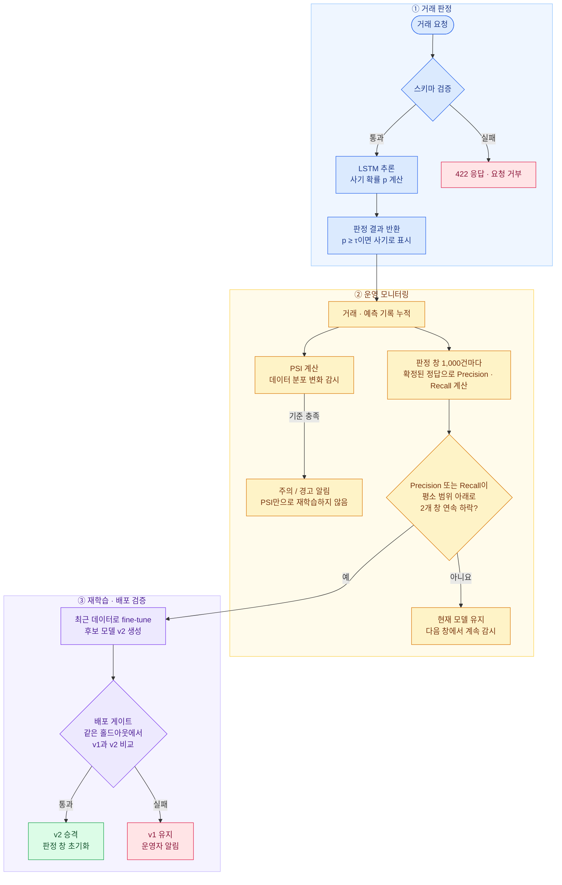

# 카드 이상거래 탐지 AIOps 설계 지표

> 기획서 ② 운영 목표와 ③ 운영 설계의 근거 문서입니다.
> `[측정]` 표시는 v1 학습 후 실제로 재서 채우는 값이고, `[가정]` 표시는 팀이 업무 상황을 가정해 정하는 값입니다.
> 나머지 숫자는 출발값이며, 측정 결과를 보고 조정합니다.

## 0. 한눈에 보기

| 구분 | 지표 | 기준 | 결과 |
|---|---|---|---|
| 입력 검증 | 스키마 | 시퀀스 길이, 값 범위 위반 | 422로 거부 |
| 분류 기준점 τ | F2 | 검증 데이터에서 F2가 최대인 확률값 | 모델 버전마다 MLflow에 기록 |
| 배포 게이트 | F2, Recall, 경보 비율 | F2(v2) ≥ F2(v1), Recall ≥ 0.95, 경보 비율 ≤ 6% | 셋 다 통과하면 승격, 하나라도 실패하면 현재 운영 모델 유지 |
| 조기 경보 | PSI | 0.1 이상 주의, 0.25 이상 경고 | 알림만 보냄 |
| 드리프트 트리거 | Precision, Recall | 평소 평균 − 2σ 아래로 2개 창 연속 | 재학습 시작 |

전체 흐름은 다음과 같습니다.



## 1. 왜 정확도를 쓰지 않는가

이상거래 비율이 약 3.7%이기 때문에 모델이 모든 거래를 정상으로 판정해도 정확도는 96.3%가 나옵니다.
사기를 한 건도 잡지 못한 모델이 높은 점수를 받으므로, 이 설계에서는 정확도를 어떤 판단에도 쓰지 않습니다.
그 대신 실제 사기 중 잡아낸 비율인 Recall과, 사기로 표시한 거래 중 진짜 사기의 비율인 Precision을 기본 단위로 씁니다.

## 2. 입력 스키마 검증

잘못된 입력이 모델까지 들어가면 서버는 정상 응답하면서도 틀린 확률을 내놓습니다.
그래서 HAIC 스켈레톤의 `schemas.py`처럼 요청 단계에서 형식을 강제하고, 위반하면 422로 거부합니다.

| 항목 | 규칙 |
|---|---|
| 시퀀스 길이 | 카드별 최근 거래가 정확히 20건 |
| 승인 금액 | 0보다 큼 |
| 국내/해외 | 0 또는 1 |
| 업종, 지역 코드 | 학습 데이터에 있던 코드 범위 |
| 카드 한도 | 0보다 큼 |

## 3. 분류 기준점 τ

LSTM은 사기일 확률만 내놓기 때문에, 몇 % 이상을 사기로 표시할지 정하는 기준점이 따로 필요합니다.
기준점에 따라 Recall과 Precision이 함께 바뀌므로, 배포 게이트와 같은 F2를 기준으로 고릅니다.

- 정하는 법: 검증 데이터에서 τ를 0.01 간격으로 바꿔 가며 F2를 계산하고, F2가 가장 높은 값을 고릅니다.
- 기록: 모델마다 최적 τ가 다르기 때문에 MLflow에 모델 버전과 함께 파라미터로 남깁니다. v2가 승격되면 τ도 v2의 값으로 바뀝니다.

## 4. 배포 게이트

배포 게이트는 새로 학습한 후보 모델(v2)을 내보내도 되는지 판단합니다.
추가 학습을 했다고 항상 나아지지는 않기 때문에, 서비스에 올리기 전에 현재 모델(v1)과 같은 시험지로 비교합니다.

### 4-1. 지표: F2

카드 사기에서는 사기를 놓친 손해가 정상 고객을 잘못 막은 손해보다 훨씬 크기 때문에 Recall에 더 무게를 둡니다.
F-beta 점수의 β는 Recall을 Precision보다 몇 배 중요하게 볼지를 뜻합니다.

```
F_β = (1 + β²) × Precision × Recall ÷ (β² × Precision + Recall)
```

β = 2로 정한 근거는 다음과 같습니다.

| 비교 항목 | 값 |
|---|---|
| 사기 1건을 놓친 손해 | 학습 기간 이상거래 평균 승인 금액 1,040,459원 |
| 정상 고객 1명을 잘못 막은 손해 | 확인 전화와 결제 실패 불편 `[가정]` (정상 거래 평균 금액은 24,893원) |

놓친 손해가 잘못 막은 손해보다 크므로 Recall 쪽에 무게를 둡니다.

β는 무엇을 더 중요하게 볼지 정하는 기준이라서, 점수가 가장 높은 β를 고르는 방식으로는 정할 수 없습니다.
β마다 자기 기준으로는 항상 최고점이 나오기 때문입니다.
그래서 β를 한 단계 올릴 때 사기를 몇 건 더 잡고, 그 대가로 정상 고객을 몇 명 더 막는지를 v1로 비교했습니다(`scripts/compare_beta.py`, 2024년 상반기 235,562건, 실제 사기 8,475건).

| β | τ | Recall | Precision | 경보 비율 | 놓친 사기 | 잘못 막은 정상 | 이전 β 대비 더 잡은 사기 / 더 막은 정상 |
|---|---|---|---|---|---|---|---|
| 1 | 0.49 | 0.898 | 0.849 | 3.81% | 862 | 1,357 | |
| **2** | **0.28** | **0.952** | **0.770** | **4.45%** | **408** | **2,409** | 454 / 1,052 (사기 1건당 2.3명) |
| 3 | 0.16 | 0.978 | 0.683 | 5.15% | 188 | 3,849 | 220 / 1,440 (6.5명) |
| 4 | 0.11 | 0.986 | 0.638 | 5.56% | 120 | 4,732 | 68 / 883 (13.0명) |
| 5 | 0.06 | 0.993 | 0.585 | 6.11% (상한 초과) | 59 | 5,979 | 61 / 1,247 (20.4명) |

β를 1에서 2로 올리면 정상 고객 2.3명을 더 확인하는 대가로 사기 1건(평균 104만 원)을 더 잡습니다.
확인 전화 2.3번의 비용이 104만 원보다 훨씬 작기 때문에 β = 1보다 β = 2가 낫습니다.

β를 3 이상으로 올리면 사기 1건을 더 잡는 대가가 6.5명, 13명, 20명으로 빠르게 커집니다.
또 β = 2의 경보 비율 4.45%는 상한 6%까지 1.55%p의 여유가 있지만, β = 3은 0.85%p, β = 4는 0.44%p만 남습니다.
명절처럼 거래가 몰리거나 드리프트로 경보가 늘어나는 시기에는 이 여유가 먼저 소진됩니다.
그래서 대가가 가장 작은 구간까지만 올리고 β = 2에서 멈췄습니다.
경보 상한을 더 크게 잡을 수 있는 조직이라면 β = 3도 선택할 수 있습니다.

### 4-2. 통과 조건 (셋 다 만족)

| 조건 | 기준 | 근거 |
|---|---|---|
| ① 성능 회귀 없음 | 같은 최근 홀드아웃에서 F2(v2) ≥ F2(v1) | 두 모델을 같은 데이터로 비교하므로 이상거래 비율 차이가 결과에 끼어들지 않습니다 |
| ② Recall 하한 | Recall(v2) ≥ R_min | 출시 시점보다 사기를 더 놓치는 모델은 내보내지 않습니다 |
| ③ 경보 비율 상한 | 경보 비율(v2) ≤ 6% `[가정]` | 전체 거래 중 사기로 판정한 비율을 직접 제한합니다 |

**R_min**은 v1을 검증 데이터에서 측정한 Recall을 소수 둘째 자리에서 내린 값입니다 `[측정]`.

**경보 비율은 직접 계산해 6% 이하인지 검사합니다.**
이전에는 `P_min = 사기율 × R_min ÷ 경보 상한`을 썼으나, 실제 Recall이 R_min보다 높으면 경보가 상한을 넘고도 Precision 검사를 통과할 수 있었습니다.
β=5의 실측 경보 비율 6.11%가 이 사례였습니다. 그래서 P_min 0.5696은 계산 경위를 설명하는 참고값으로만 남기고, 게이트에는 사용하지 않습니다.

최초 v1은 비교할 운영 모델이 없으므로 Recall과 경보 비율의 절대 기준만 검사합니다.
이미 운영 모델이 있으면 두 모델을 같은 홀드아웃에서 평가하고 F2가 낮아지는 후보도 차단합니다.
평가에는 최소 1,000건, 실제 이상거래 20건 이상, 정상 거래가 필요하며 점수의 NaN이나 범위 오류는 거부합니다.

### 4-3. 홀드아웃

HAIC 스켈레톤은 fine-tune 데이터 41행을 8:2로 나누기 때문에 검증 샘플이 5개뿐이고, 게이트 결과가 우연에 좌우될 수 있습니다(통합가이드 p.22).
이상거래는 3.7%뿐이라 같은 방식으로 나누면 검증 데이터에 사기가 거의 남지 않습니다.
그래서 fine-tune에 쓰지 않은 최근 1,000건 이상을 홀드아웃으로 떼어 두고, 그 안에 이상거래가 20건 이상 들어가도록 합니다.
과거 데이터로만 평가하면 새 패턴에 적응한 v2의 장점이 드러나지 않으므로, 홀드아웃은 최근 구간에서 뽑습니다.
τ를 고르는 데이터도 게이트 데이터에서 분리합니다. τ를 고른 시험지로 다시 합격 여부를 판단하면 점수가 낙관적으로 나올 수 있기 때문입니다.

이번 최초 등록에서는 기간을 성능 확인 전에 고정했습니다.

| 거래 기간 | 용도 |
|---|---|
| 2021~2023 | v1 학습과 스케일러 fit |
| 2024년 상반기 | τ 선택, β 비교, 운영 기준 측정 |
| 2024년 7월 | 최초 배포 게이트만 평가 |
| 2024년 8~12월 | 이후 운영 시연에 사용할 구간 |

위 날짜는 데이터에 기록된 거래 시점입니다. 과제 마감은 2026-10-08입니다.
첫 게이트는 40,324건(이상거래 1,496건)에서 Recall 0.9104, 경보 비율 0.04295, F2 0.8826이었습니다.
Recall 0.95에 미달해 운영 승격을 보류했습니다. 상반기 Recall 0.9519는 τ 선택에 사용한 구간의 결과이며, 7월 독립 결과와 구분합니다.
운영 승격을 보류한 후보도 MLflow Tracking과 Registry에 기록하지만, 운영 모델을 선택하는 `champion` 별칭은 부여하지 않습니다.


## 5. 드리프트 감시

### 5-1. 왜 두 종류의 신호가 필요한가

현실에서는 사기 여부가 고객 신고나 탐지팀 확인을 거쳐 늦게 확정되므로, 성능 지표만 보면 문제를 늦게 알아챕니다.
반대로 거래의 모양이 바뀌었다고 해서 모델 성능이 반드시 떨어지는 것은 아닙니다.
그래서 정답 없이 바로 볼 수 있는 PSI는 경보 역할만 맡고, 재학습 여부는 정답으로 계산한 성능 지표가 결정합니다.

> 이번 시연은 배치 요청에 정답을 함께 보내는 시뮬레이션이기 때문에 정답이 즉시 들어옵니다.
> 실제 운영에서는 정답 지연이 생긴다는 점을 발표에서 밝힙니다.

### 5-2. 조기 경보: PSI

PSI는 학습 기간의 분포와 최근 판정 창의 분포가 얼마나 달라졌는지를 하나의 숫자로 나타냅니다.

```
PSI = Σ (최근 비율 − 기준 비율) × ln(최근 비율 ÷ 기준 비율)
```

| 항목 | 설정 |
|---|---|
| 대상 | 승인 금액, 승인 시간대, 해외 여부, 업종, 모델이 낸 사기 확률 |
| 구간 | 수치형은 학습 데이터 기준 10분위, 범주형은 범주별 비율 |
| 0인 칸 | 로그 계산이 불가능하므로 0.0001로 대체 |
| 기준 | 하나라도 0.1 이상이면 주의, 0.25 이상이면 경고 |
| 동작 | 알림만 보냄. 재학습하지 않음 |

0.1과 0.25는 신용평가 분야에서 오래 써 온 관례값입니다.
교수님 가이드 p.22는 정답이 늦게 오는 상황에서 KS 검정이나 PSI로 입력 분포를 먼저 감지하는 방법을 조별 확장 과제로 제시합니다.

### 5-3. 드리프트 트리거: Precision과 Recall

두 지표는 서로 다른 고장을 봅니다.
Precision이 떨어지면 정상 고객을 사기로 잘못 막는 일이 늘었다는 뜻입니다.
Recall이 떨어지면 사기를 놓치고 있다는 뜻입니다.

모델이 신종 사기를 알아보지 못하면 그 거래는 사기로 표시되지 않습니다.
표시되지 않은 거래는 Precision 계산에 들어가지 않으므로, 신종 사기는 Precision으로 잡히지 않고 Recall에서만 드러납니다.
그래서 두 지표를 모두 감시합니다.
Precision은 탐지팀이 의심 거래를 바로 확인하기 때문에 정답이 빨리 쌓이는 장점이 있습니다.

| 항목 | Precision 트리거 | Recall 트리거 |
|---|---|---|
| 판정 창 | 최근 1,000건 | 최근 1,000건 |
| 판정 보류 | 창 안 경보가 30건 미만 | 창 안 실제 사기가 20건 미만 |
| 기준값 | 정상 창 평균 − 2σ `[측정]` | 정상 창 평균 − 2σ `[측정]` |
| 판정 | 2개 창 연속으로 기준 미만 | 2개 창 연속으로 기준 미만 |

**판정 창을 1,000건으로 잡은 이유**: HAIC는 21건씩 판정하지만, 사기율 3.7%에서는 21건 안에 사기가 평균 1건도 들어가지 않아 Recall을 계산할 수 없습니다.
1,000건이면 사기가 평균 37건 정도 들어갑니다.

**고정 비율 대신 −2σ를 쓰는 이유**: 모델이 멀쩡해도 창마다 점수가 흔들립니다.
예를 들어 Precision이 0.7이고 창 하나에 경보가 40건이라고 가정하면, 표준오차가 약 0.07이므로 정상 창끼리도 ±0.14 정도 차이가 날 수 있습니다.
이 크기는 0.7의 20%에 해당합니다. 따라서 "평소보다 20% 하락" 같은 고정 기준은 정상적인 흔들림에도 울립니다.
그래서 v1을 정상 기간의 창들에 돌려 평균과 표준편차를 재고, 그 범위 밖으로 벗어날 때만 문제로 봅니다.
실제로 측정한 정상 창 Precision의 표준편차는 0.0702로 이 추정과 같았습니다.

**2개 창 연속을 요구하는 이유**: 한 번 튄 값으로 재학습하면 비용만 들기 때문에, 하락이 이어질 때만 판정합니다.
HAIC가 21건보다 짧은 창을 쓰지 않은 이유와 같습니다.

### 5-4. PSI와 성능 지표의 조합

PSI와 성능 지표는 단위가 달라서 가중치를 곱해 더하기 어렵습니다.
가중치를 맞추려면 실제 드리프트 사례가 필요한데, 우리에게는 그런 사례가 없습니다.
그래서 가중합 대신 규칙으로 조합합니다.

처음에는 PSI가 경고(0.25 이상)인 동안 성능 트리거 기준을 평균 − 2σ에서 평균 − 1σ로 좁히려고 했습니다.
거래 모양이 크게 바뀐 상태라면 성능 하락을 더 빨리 잡아야 한다고 보았기 때문입니다.

그런데 v1을 2024년 상반기 정상 데이터(1,000건 창 235개)에 돌려 보니 결과가 달랐습니다.

| 기준 | 기준 미달 창 (Precision 또는 Recall) | 2개 창 연속 미달 = 잘못된 재학습 |
|---|---|---|
| 평균 − 2σ | 13개 | 0회 |
| 평균 − 1σ | 58개 | 15회 |

−1σ 기준은 정상 기간에도 재학습을 15번 일으킵니다.
명절처럼 거래 모양만 바뀐 상황에서 기준을 좁히면 성능이 그대로여도 재학습이 돌 가능성이 높습니다.
그래서 기준을 좁히는 규칙은 빼고, PSI는 알림만 보내며 재학습은 항상 평균 − 2σ와 2개 창 연속 조건으로 판단합니다.
기준 아래로 떨어진 창은 정상 기간에도 13개 있었으므로, 2개 창 연속 조건이 오탐을 막는 핵심입니다.

| 상황 | PSI | Precision | Recall | 결과 |
|---|---|---|---|---|
| 평상시 | 정상 | 정상 | 정상 | 없음 |
| 명절 소비 증가 | 상승 | 정상 | 정상 | 알림만 |
| 정상 고객 패턴 변화로 오탐 증가 | 상승 | 하락 | 정상 | 재학습 |
| 신종 사기 등장 | 상승 | 정상 | 하락 | 재학습 |

교수님은 수업에서 추석처럼 물량이 커지면 RMSE만으로는 드리프트로 잘못 판단한다는 문제를 제기했습니다.
이 설계에서는 거래 모양만 바뀌고 성능은 그대로인 경우 재학습하지 않으므로, 같은 문제를 피할 수 있습니다.

## 6. 재학습 정책

| 항목 | 설정 | 근거 |
|---|---|---|
| 방식 | 현재 Production 가중치에서 이어서 학습(fine-tune) | 처음부터 학습하면 시간이 오래 걸리고, 최근 데이터만으로는 사기 수가 부족합니다 |
| 데이터 | 정답이 확정된 최근 거래 중 홀드아웃을 뺀 구간 `[팀 결정: 건수]` | 최근 패턴을 반영하기 위해서입니다 |
| 전처리 | 학습 때 저장한 스케일러를 그대로 사용 | 스케일러를 다시 맞추면 같은 금액이 다른 숫자로 들어가 기존 가중치와 어긋납니다(가이드 p.22) |
| 게이트 실패 시 | 기존 운영 모델 유지, 최초 등록이면 운영 승격 보류 | 서비스는 멈추지 않고 사람이 원인을 점검합니다 |
| 승격 후 | 판정 창 초기화 | 재학습 전 예측이 창에 남아 있으면 바로 다시 드리프트로 판정됩니다(가이드 트러블슈팅 #7) |
| 실행 위치 | BackgroundTasks로 분리 `[선택]` | 재학습이 요청 처리 안에서 돌면 응답이 늦어집니다(가이드 트러블슈팅 #8) |
| 롤백 | 승격 직후 다시 트리거되면 MLflow의 이전 버전으로 되돌림 | 게이트를 통과했어도 운영 데이터에서 실패할 수 있기 때문입니다 |

## 7. 시연 시나리오

| 장면 | 주입 방법 | 기대 결과 |
|---|---|---|
| ① 정상 | 학습 기간과 같은 분포의 거래 | 알림 없음 |
| ② 명절 | 승인 금액과 건수를 늘린 정상 거래 | PSI 경고, 재학습 없음 |
| ③ 신종 사기 | 해외 소액 결제가 짧은 간격으로 이어지는 사기 패턴 | Recall 하락, 재학습, 게이트 통과 시 v2 승격 |

③에서 Recall이 기준 아래로 떨어지지 않으면 주입 패턴을 더 강하게 바꿉니다.
②와 ③은 시뮬레이션 데이터이며, 발표에서 그렇게 밝힙니다(가이드 Q&A 1).

## 8. 값을 채우는 순서

1. v1을 학습하고 검증 데이터에서 τ, F2, Recall, Precision을 기록합니다. 여기서 R_min이 정해집니다.
2. 팀이 경보 상한 비율과 오탐 1건 비용을 가정합니다. 여기서 P_min과 β의 근거가 정해집니다.
3. 정상 기간을 1,000건 창으로 나눠 v1을 돌리고, 창마다 Precision, Recall, PSI를 구합니다. 평균과 표준편차로 트리거 기준값을 정합니다.
4. 시나리오 ②와 ③을 주입해 기대 결과가 나오는지 확인합니다.

### v1 측정 기록표

| 항목 | 값 |
|---|---|
| 입력 시퀀스 길이 N | 20 |
| τ | 0.28 |
| 검증 F2 / Recall / Precision | 0.9089 / 0.9519 / 0.7700 |
| 검증 PR-AUC (아무 학습 없는 기준선) | 0.9419 (0.0360) |
| 경보 비율 | 4.45% |
| R_min | 0.95 |
| 경보 상한 비율 `[가정]` | 6% |
| P_min (참고값, 게이트 미사용) | 0.5696 |
| 이상거래 평균 승인 금액 | 1,040,459원 (정상 24,893원의 약 42배) |
| 정상 창 Precision 평균 / 표준편차 | 0.7694 / 0.0702 (창 224개) |
| 정상 창 Recall 평균 / 표준편차 | 0.9506 / 0.0437 (창 232개) |
| Precision 트리거 기준 (−2σ) | 0.6290 |
| Recall 트리거 기준 (−2σ) | 0.8632 |
| 정상 창 PSI 최댓값 | 금액 0.065, 시간대 0.079, 가맹점 매출구간 0.019, 해외 0.000, 할부 0.000, 예측 확률 0.036 (모두 주의 기준 0.1 미만) |
| 정상 기간 잘못된 재학습 | 0회 (−2σ, 2개 창 연속) |
| 시나리오 ② PSI 최댓값 | |
| 시나리오 ③ Recall | |

## 9. 팀 확인이 필요한 항목

- 드리프트 트리거에 Recall을 포함할지 정해야 합니다. 빼면 신종 사기 장면(시나리오 ③)이 트리거되지 않습니다.
- 경보 상한 비율과 오탐 1건 비용은 팀이 가정하고, 기획서에 가정이라고 적어야 합니다.
- 입력 시퀀스 길이는 20건으로 확정했습니다. fine-tune 데이터 건수는 다음 단계에서 정합니다.
- 데이터 수치는 확인을 마쳤습니다. 전체 1,952,871건, 이상거래 3.69%로 판정 창 1,000건 계산은 그대로 유지됩니다([데이터분석.md](데이터분석.md)).
